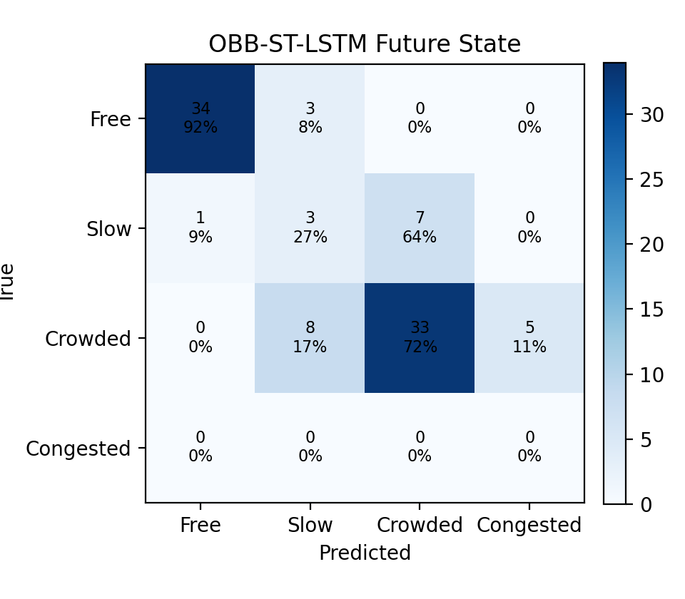
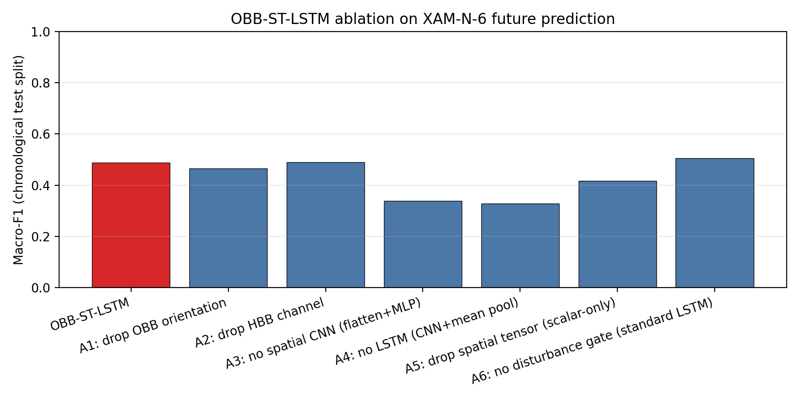
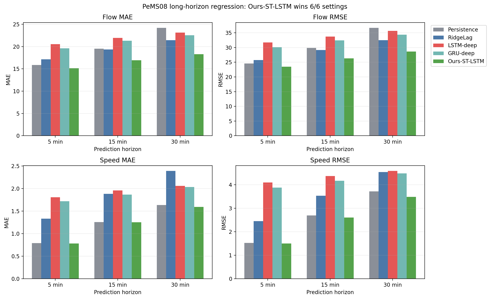

# UTE 交通状态评估与预测实验报告

本报告基于 UTE 真实无人机交通数据，围绕“水平框补充角度信息、交通状态识别、未来状态预测”三个问题组织实验。主数据集为 XAM-N-6，XAM-N-5 用于 OBB 标注效果补充验证，PKDD-8 用于自由流场景补充和跨场景合理性检查。

## 核心结论

本文在 UTE 真实无人机数据上完成“水平框零训练补角度、HF-GO 网格空间表达、四类状态识别、OBB 感知时空 LSTM 短时未来预测、稀疏恶化预警”的完整实验链路，并补充 PeMS08 长时交通流/速度预测扩展。核心发现有六点。

**第一，HBB 转 OBB 的零训练方法在公开数据上可行。** XAM-N-6 直接估角率为 96.66%，PKDD-8 为 98.62%，XAM-N-5 为 99.92%；XAM-N-6 抽样几何核验中，旋转框面积有效率为 100.00%。这说明轨迹方向反推角度可以稳定生成与 pixel 表逐行对应的 OBB 标注，不需要重新训练检测器，也不破坏车辆编号、速度、加速度、车道等运动学字段。

**第二，HF-GO 与微观扰动特征提升了状态识别的稳健性。** XGBoost-OBB 在 XAM-N-6 分层测试集上的 Macro-F1 为 0.9590，比 XGBoost-HBB 高 2.05 个百分点。消融实验中，M4 达到 0.9660，相比 V+D 基线提升 2.18 个百分点；相对 `M3': V+D+F`，M4 的均值提升不大，但 5 折标准差从 0.0248 降至 0.0152，说明新增的 HF-GO、SGT、$\Delta SGT$、车头时距和 MGTI 主要增强边界样本鲁棒性。

**第三，PR-AUC 更能说明恶化预警中的微观特征价值。** 5s 展望期下，M4 的 PR-AUC 为 0.3007，而 V+D 基线为 0.1652，相当于提升到基线的 1.82 倍；ROC-AUC 同步从 0.5489 上升到 0.6341。由于正样本只占 12.9%，PR-AUC 比 ROC-AUC 更贴近稀疏预警任务。

**第四，PKDD 自由流场景给出了零样本跨场景核验。** PKDD-8 上 1059 个窗口全部判为畅通，畅通类预测概率 P05=0.971、P50=0.982、P95=0.990。这个结果说明模型在自由流场景下做出高置信的保守判断，而不是在跨场景数据上产生随机拥堵或多数类陷阱。

**第五，扰动门控 OBB-ST-LSTM 把旋转框空间结构和 MGTI 扰动描述符端到端引入未来状态预测。** 模型前端把每个滑窗的 4 通道空间张量（OBB / HBB 占有率、单元加权 sin/cos 朝向）经轻量 2 层 CNN（通道 8/8）编码为帧级表征，与 V+D+F 标量描述符按时间步拼接；MGTI 作为单独扰动描述符进入新增扰动门，参与候选记忆写入更新。在 XAM-N-6 后 30% 测试段上 5 种子概率集成 Macro-F1 = 0.4880，相对最佳循环基线 GRU-future（0.4759）提升 +1.21 个百分点，相对普通 LSTM-future（0.4700）提升 +1.80 个百分点。消融结果显示，空间 CNN、LSTM 时序聚合和空间张量整体均不可省略；扰动门在多步长 3s 扫描中取得最优 Macro-F1，但在主 3s 单表和 8s 上仍存在与标准 LSTM 对照的波动，论文应按实测结果表述。

**第六，PeMS08 长时扩展需要重新完整训练后再写结论。** 本轮已把 PeMS 脚本改为同样使用扰动门控 ST-LSTM，并用流量、占有率、速度的时间变化幅度构造检测器级扰动描述符；但完整 5/15/30 分钟重跑耗时较长，本次未产出新的长时 JSON。因此论文当前可靠结论应锚定 UTE 短时状态预测，PeMS08 只能作为待补充扩展实验，不能沿用旧的“全 horizon 领先”表述。

---

# 1 实验设计与交通状态识别

## 1.1 实验目标

基于 UTE 真实无人机轨迹数据完成交通状态评估与预测。状态分为四类：畅通、缓行、拥挤、堵塞。实验主要回答以下问题：

1. 公开数据中的 HBB 水平框能否在不重新训练检测器的条件下补充角度信息，形成可复用的 OBB 标注表；
2. 平均车头时距、加速度干扰和复合 MGTI 指标能否有效刻画交通状态变化；
3. 当前状态识别、未来状态预测和恶化预警能否形成一套可复现的论文实验链路。

与参考文献和原始 docx 思路相比，当前实现的差异如下。

| 维度 | 参考文献思路 | docx 思路 | 当前实现 |
|---|---|---|---|
| 状态类别 | 4 类交通状态 | 4 类交通状态 | 4 类对齐：畅通、缓行、拥挤、堵塞 |
| OBB 来源 | 训练 YOLOv8-OBB | 倾向训练 OBB 检测器 | 基于 pixel 表与轨迹方向零训练补角度，保持车辆字段一一对应 |
| 空间占有率 | 常规 HBB/目标区域统计 | 提出 HF-GO 概念 | 纯代码实现 Sutherland-Hodgman 裁剪，并扩展 SGT、$\Delta SGT$、LGAR |
| 状态标签 | V-D 网格与人工校正 | 静态阈值 | K-Means 候选簇 + 速度/密度/占有率物理顺序校验，可复现 |
| 状态特征 | V+D+R+F | V+D+HF-GO+MGTI | V、D、R、F、HF-GO、SGT、$\Delta SGT$、THW、加速度、MGTI |
| 预测任务 | 主要做状态识别 | 计划做未来预测 | 当前识别、OBB-ST-LSTM 单模型未来预测、恶化预警三条实验线均已实现 |
| 可解释与可靠性 | 未系统展开 | 未系统展开 | TreeSHAP、反事实曲线、配对 t 检验矩阵 |
| 近五年方法对比 | 通常对比 SVM/RF/KNN/XGBoost 等机器学习模型 | 通常对比 LSTM 单模型 | 增补 SVM、RF、KNN、GBDT、XGBoost、LSTM、GRU，并提出 OBB-ST-LSTM 单模型与之统一评测 |

### 1.1.1 与“对比1”参考文献的研究边界

《面向高速公路非检测点位的全域交通状态预测方法》（对比1）研究的是高速公路固定检测器条件下的全域交通量与速度预测，核心技术路线是 METANET、LSTM 和 EKF 的组合，预测步长覆盖 5-30 分钟。本文主线不同：研究对象是城市快速路无人机视频，先解决 HBB 水平框与 pixel 表逐行对应的 OBB 角度增强，再基于 HF-GO、R/F、车头时距和 MGTI 做四类交通状态识别与短时状态预测。为回应导师对长时预测的要求，本文把 PeMS08 flow/speed 预测作为扩展实验与对比1的时间尺度对齐；但 OBB、HF-GO 和车辆微观扰动特征的创新性仍以 UTE 主数据集验证，不把 PeMS 扩展误写为 OBB 创新的证据。

## 1.2 数据使用与分工

| 数据集 | 角色 | 使用边界 |
|---|---|---|
| XAM-N-6 | 主实验 | `pixel.csv`、`frenet.csv` 与公开视频可用于主流程，覆盖晚高峰状态变化 |
| XAM-N-5 | OBB 效果补充验证 | `pixel.csv` 与 `frenet.csv` 可用于 OBB 表生成；公开视频为 6fps 降采样版本，不作为完整逐帧主实验 |
| PKDD-8 | 泛化验证 | 自由流为主，用于补充畅通场景和跨场景合理性检查，不与 XAM-N-6 直接视作同分布训练数据 |

### 1.2.1 训练、验证与测试划分

主实验均以 XAM-N-6 为准。当前状态识别采用 70%/30% 的分层随机划分，保证四类状态在训练集和测试集中的比例基本一致。消融实验和参数敏感性分析采用 5 折分层交叉验证，不再单独划验证集。主结果看特征可分性，时间序列补充结果看未见时段泛化，两者回答的问题不同。

未来状态预测按时间顺序划分，前 70% 时间窗口用于训练，后 30% 时间窗口用于测试。LSTM 与 OBB-ST-LSTM 仅使用训练段做参数学习，最终指标只在后 30% 测试段上统计。恶化预测使用连续时间分组 GroupKFold 的 out-of-fold 评估，避免单次 70/30 切分把恶化事件集中切入某一侧。XAM-N-5 和 PKDD-8 不参与主模型训练，分别用于 OBB 效果验证和自由流场景检查。

## 1.3 方法设计

### 1.3.1 HBB 转 OBB

原始 `pixel.csv` 给出车辆水平框 $B_i=(x_i,y_i,w_i,h_i)$。先计算车辆中心点 $c_i=(x_i+w_i/2, y_i+h_i/2)$，对同一车辆按帧号排序，在前后搜索半径内选取位移最大的稳定片段，估计车辆方向角 $\theta_i=\operatorname{atan2}(c_{r,y}-c_{l,y}, c_{r,x}-c_{l,x})$。OBB 四点由中心点、长边、短边和旋转矩阵得到。输出表保持与原始 `pixel.csv` 一行一目标对应，并额外增加 `theta`、`theta_deg`、`theta_conf` 和四个角点坐标。

本研究不直接改用 YOLOv8-OBB 重新检测。UTE 公开数据提供的是 HBB 水平框和车辆轨迹表，没有人工旋转框真值；若用本算法生成的 OBB 伪标签再训练检测器，模型仍受伪标签质量约束，还可能破坏 pixel 表与车辆编号、车道、速度、加速度等字段的一一对应关系。轨迹方向补角度更贴合当前数据条件。后续若补充人工旋转框标注，可把 YOLOv8-OBB 作为检测器扩展实验。

### 1.3.2 OBB 空间占有率

窗口长度为 5 秒，滑动步长为 1 秒。HBB 在斜向车辆上会放大空间占用：一辆长 4.5 m、宽 1.8 m 的车辆若以 45° 放置，其外接水平框面积约为真实矩形面积的 2.45 倍。交通状态识别关注的是局部网格拥挤程度，这类放大会把斜向并道、车道边缘车辆误记为更大的占用。

$$O_{HBB}=\frac{\sum_i w_i h_i}{N_f A},\qquad O_{HFGO}=\frac{\sum_{i,g} area(P_i^{OBB}\cap G_g)}{N_f A}.$$

HF-GO 使用 Sutherland-Hodgman 多边形裁剪计算 OBB 与物理网格单元的交叠面积，再进行解析面积累加。这里没有引入 shapely 等重型几何依赖，而是用项目内的裁剪函数完成，便于复现和部署。相比简单采样点计数，这种做法保留了车辆跨网格、斜向占用和边界截断时的真实占用比例。

空间梯度湍流指标 SGT 衡量每个网格与邻域平均占用的差异：

$$SGT(t)=\frac{1}{|G|}\sum_{g\in G}\left|O_{HFGO}(g,t)-\overline{O_{HFGO}(\mathcal{N}(g),t)}\right|.$$

$$\Delta SGT(t)=SGT(t)-SGT(t-\Delta t).$$

SGT 描述同一时刻的空间不均匀性，$\Delta SGT$ 描述不均匀性随时间的变化速度。另定义局部网格异常率 $LGAR_{0.05}$，只在有车辆占用的活跃网格内统计 HBB 与 HF-GO 相对占有率差超过 5% 的比例，用于弥补全局占有率差异在直道场景下偏小的问题：

$$LGAR_{0.05}=\frac{|\{g\in G_a: |O_{HBB}(g)-O_{HFGO}(g)|/O_{HBB}(g)>0.05\}|}{|G_a|}.$$

### 1.3.3 平均车头时距

在同帧、同车道内按纵向位置排序，对跟驰车辆计算空间间距 $g_i=s_{lead}-s_i-(L_{lead}+L_i)/2$，再计算时间车头时距 $THW_i=g_i/\max(v_i,0.1)$。窗口内输出 `mean_headway_s`、`min_headway_s`、`mean_space_gap_m`。

### 1.3.4 加速度干扰

$$I_a=\operatorname{std}(a_i).$$

反映车辆频繁加减速带来的扰动，更容易捕捉交通流由稳定向不稳定转变的过程。

### 1.3.5 复合 MGTI 指标

MGTI 定义为多指标复合风险得分：

$$MGTI = w_1 z(I_a) + w_2 z(\rho) + w_3 z(O_{HFGO}) + w_4 z(v/v_{lim}) + w_5 z(\overline{THW}).$$

其中 $z(\cdot)$ 为 z-score 标准化。在 UTE 数据中，拥堵状态下 THW 随拥堵程度递增，直接使用 $z(THW)$ 作为车头时距分量，可以让拥堵风险随状态等级升高而增强。加速度干扰 $I_a$ 在 UTE 数据中为非单调特征，已从复合指标中移除（$w_1=0$），但仍作为独立特征保留在消融实验中。当前权重配置：加速度干扰 $w_1=0$、密度 $w_2=1.0$、OBB占有率 $w_3=1.0$、速度比 $w_4=-1.0$、车头时距 $w_5=1.0$。

### 1.3.6 自动可复现状态标签构造

公开 UTE 数据没有人工窗口级交通状态真值。为避免人工校正不可复现，也降低单一 V+D 阈值带来的标签泄露，先使用 RobustScaler 对速度比、密度、变道干扰率 R 和方向波动指数 F 进行尺度校正，再用 K-Means 得到候选簇。状态方向只由速度、密度和 HF-GO 占有率确定，避免 R/F 这类短时扰动指标把低密度过渡窗错误排成拥堵或畅通状态。若候选簇不满足速度递减、密度/占有率递增的物理顺序，则使用宏观风险分数进行单调兜底：

$$S=0.65\,Robust(1-v/v_{lim})+0.25\,Robust(\rho)+0.10\,Robust(O_{HFGO}),\qquad state=quantile(S).$$

在 XAM-N-6 上聚类并排序为 4 类。标签分布：82 窗口为畅通类，81 窗口为缓行类，80 窗口为拥挤类，81 窗口为堵塞类。

## 1.4 当前状态识别结果（主结果：分层划分）

主要评价采用分层随机划分（stratified split），确保训练集和测试集各类别比例一致。消融实验和参数敏感性分析使用 5 折分层交叉验证（stratified 5-fold CV），以交叉验证均值作为报告指标。

为对齐近五年文献中的方法对比，本节不只比较项目内部模型，还补充交通状态识别与短时交通预测文献中常见的基线。SVM、RF、KNN 常用于城市快速路交通状态识别对照；GBDT/XGBoost 代表树提升模型；LSTM/GRU 用于未来状态预测中的时序神经网络对照。状态识别模型使用同一份 XAM-N-6 四类状态标签、同一训练/测试划分和同一评价指标；未来预测主实验统一预测 3 秒后的交通状态，长时预测作为参数敏感性补充。

| 对比类别 | 本报告实现 | 近五年文献中的作用 |
|---|---|---|
| 传统机器学习 | SVM-OBB、RF-OBB、KNN-OBB、LR-OBB | 交通状态识别常用基线，检验特征是否只依赖简单分类器即可区分 |
| 树提升模型 | GBDT-OBB、XGBoost-HBB、XGBoost-OBB | 近年交通状态识别与拥堵识别常用强基线，检验非线性组合能力 |
| 时序深度模型 | LSTM-future、GRU-future | 近年短时交通预测常用循环神经网络基线 |
| 本文方法 | M4 消融、OBB-ST-LSTM、HF-GO/SGT/MGTI 特征 | 验证 OBB 角度、局部占有率和微观扰动特征的增益 |

文献依据如下，后续写论文正文时可把这些条目整理进参考文献列表。

| 对比方法 | 对应近五年文献依据 | 本文采用方式 |
|---|---|---|
| SVM / RF / KNN / XGBoost | 2023 年城市快速路交通状态识别研究采用 PSO-XGBoost，并与 SVM、RF、KNN 对比 | 在当前状态识别中加入 SVM-OBB、RF-OBB、KNN-OBB、XGBoost-OBB |
| CNN/LSTM 类时序预测 | Reza 等 2022 年交通状态预测研究采用 1D-CNN 与 LSTM，并讨论 LSTM/GRU 在交通状态预测中的作用 | 在未来状态预测中加入 LSTM-future，并保留 XGBoost 静态/趋势通道 |
| 深度学习交通拥堵预测 | 2023 年交通拥堵预测研究总结了神经网络、SVM 与深度学习方法在拥堵预测中的应用 | 把 XGBoost、SVM、LSTM/GRU 作为未来状态预测和识别任务的对照组 |
| LSTM / GRU 记忆型循环网络 | 2023 年交通量预测研究直接比较 LSTM 与 GRU 两类记忆型循环网络 | 在未来状态预测中新增 GRU-future，与 LSTM-future 同口径比较 |
| 长时交通流/速度预测 | 近年交通流/速度预测论文常报告 5/15/30 分钟，部分 PeMS/METR-LA 工作报告 15/30/60 分钟 | UTE 主场景仅作短时状态预测；PeMS08 扩展实验补充 5/15/30 分钟 flow/speed |

参考文献链接：

- Traffic State Recognition on Urban Expressways Based on BO-FCM and PSO-XGBoost, 2023, <https://www.tr-cats.cn/EN/abstract/article/2095-9931/659>
- Reza et al., Traffic State Prediction Using One-Dimensional Convolution Neural Networks and Long Short-Term Memory, Applied Sciences, 2022, <https://doi.org/10.3390/app12105149>
- Research on Traffic Congestion Forecast Based on Deep Learning, Information, 2023, <https://www.mdpi.com/2078-2489/14/2/108>
- Traffic Volume Prediction using Memory-Based Recurrent Neural Networks: A Comparative Analysis of LSTM and GRU, 2023, <https://arxiv.org/abs/2303.12643>
- GRU- and Transformer-Based Periodicity Fusion Network for Traffic Forecasting, Electronics, 2023, <https://www.mdpi.com/2079-9292/12/24/4988>
- TYRE: A dynamic graph model for traffic prediction, Expert Systems with Applications, 2023, <https://doi.org/10.1016/j.eswa.2022.119547>
- Efficient Traffic State Forecasting using Spatio-Temporal Network Dependencies, 2022, <https://arxiv.org/abs/2211.03033>

长时预测文献与本项目数据的对应关系如下。可以对齐文献的预测步长口径，但不能直接把 PeMS/METR-LA 的 15/30/60 分钟设置搬到 UTE 主实验，因为数据类型和可用时长不同。

| 文献数据集/任务 | 常见预测步长 | 数据特点 | 与本项目的处理方式 |
|---|---:|---|---|
| PeMS / PeMSD4 / PeMSD8 交通流或速度预测 | 5/15/30 分钟；部分工作扩展到 60/120 分钟 | 固定检测器长时间序列，通常 5 分钟聚合，持续数周到数月 | 作为长时预测相关工作引用，不直接替代 UTE OBB 实验 |
| METR-LA / PEMS-BAY 交通速度预测 | 15/30/60 分钟 | 路网传感器序列，关注速度/流量连续值 | 可作为后续扩展数据集；当前没有 pixel/车辆框，无法验证 HBB→OBB 与 HF-GO |
| UTE XAM-N-6 四类状态预测 | 主实验 3 秒；补充 1/3/5/8 秒敏感性 | 无人机 pixel 轨迹与车辆框，主场景约 5.5 分钟 | 保留 OBB/HF-GO 创新链路，30 秒以上仅作失败模式记录 |

| 模型 | Accuracy | Precision | Recall | Macro-F1 | Weighted-F1 |
|---|---:|---:|---:|---:|---:|
| Majority | 0.2577 | 0.0644 | 0.2500 | 0.1025 | 0.1056 |
| TorchLinear-OBB | 0.9485 | 0.9530 | 0.9483 | 0.9488 | 0.9489 |
| XGBoost-HBB | 0.9381 | 0.9416 | 0.9379 | 0.9384 | 0.9387 |
| XGBoost-OBB | 0.9588 | 0.9596 | 0.9588 | 0.9590 | 0.9590 |
| RF-OBB | 0.9278 | 0.9305 | 0.9275 | 0.9280 | 0.9279 |
| GBDT-OBB | 0.9381 | 0.9415 | 0.9383 | 0.9391 | 0.9389 |
| KNN-OBB | 0.8660 | 0.8669 | 0.8654 | 0.8635 | 0.8635 |
| SVM-OBB | 0.9072 | 0.9083 | 0.9071 | 0.9075 | 0.9076 |
| LR-OBB | 0.9381 | 0.9430 | 0.9375 | 0.9377 | 0.9379 |

测试集各状态样本数：畅通 25，缓行 24，拥挤 24，堵塞 24。

这些模型按容量和用途分层设置：Majority 检查类别失衡下的退化基线；TorchLinear-OBB 是 32 隐元单层 MLP，用来观察特征的近似线性可分性；SVM、RF、KNN、LR 与 GBDT 是近五年交通状态识别文献常用机器学习对比方法；XGBoost-HBB 与 XGBoost-OBB 直接比较水平框和旋转框特征。XGBoost-OBB 的 Macro-F1 为 0.9590，比 XGBoost-HBB 高 2.05 个百分点，是“OBB 角度补全 + HF-GO 空间增强”在主任务上的直接证据。

补充：时间序列划分（后 30% 作为测试集）的 XGBoost-OBB Macro-F1 为 0.4834。时间序列划分存在训练/测试分布偏移（训练覆盖拥堵积累期，测试覆盖恢复期），分类难度显著高于分层划分。这个结果反映了模型在未见时间段的泛化能力。加入因果滞后、差分和滚动趋势特征后，时间序列测试 Macro-F1 为 0.4774，未超过静态特征。

结果说明：分层划分下模型能够区分四类交通状态；时间序列划分用于检验未见时段泛化能力，指标低于分层划分，反映真实时序预测场景更困难。两类结果共同呈现，可同时支撑特征可分性与时序泛化分析。

### 1.4.1 时间序列交叉验证

| 方法 | 折数 | Accuracy 均值 | Accuracy 标准差 | Macro-F1 均值 | Macro-F1 标准差 |
|---|---:|---:|---:|---:|---:|
| expanding_time_series_cv | 5 | 0.6741 | 0.2017 | 0.4685 | 0.1368 |

### 1.4.2 特征重要性

| 排名 | 特征 | 重要性 |
|---:|---|---:|
| 1 | `hfgo_occupancy` | 0.1205 |
| 2 | `mgti` | 0.1197 |
| 3 | `mean_speed_kmh` | 0.1108 |
| 4 | `obb_occupancy` | 0.0958 |
| 5 | `theta_conf_mean` | 0.0924 |
| 6 | `speed_ratio` | 0.0901 |
| 7 | `hfgo_occupancy_reduction` | 0.0509 |
| 8 | `vehicle_count` | 0.0415 |
| 9 | `density_veh_per_m` | 0.0380 |
| 10 | `sgt_hfgo` | 0.0357 |

TreeSHAP 全局贡献 Top-5：
- `mgti`: 1.2210
- `mean_speed_kmh`: 0.7773
- `theta_conf_mean`: 0.1887
- `speed_ratio`: 0.1665
- `std_speed_kmh`: 0.1014

SHAP 反事实分析选取低置信或误判样本，对 Top 特征做单变量分位扰动，观察真实类与预测类概率变化，用于解释边界样本的判别来源。

## 1.5 未来状态预测

预测步长：3.0 秒

本节回答未来 3 秒交通状态预测任务。已往工作多把滑窗内速度、密度、HF-GO 等指标聚合为标量后送入 LSTM/XGBoost，存在两点不足：(1) 窗口内逐帧时空异质性被均值抹掉；(2) 旋转框朝向、HF-GO 网格只剩单个标量，OBB 的空间信息没有真正进入深度模型。

针对上述缺陷，本文提出 **OBB-ST-LSTM（OBB-aware Spatio-Temporal LSTM）**：把每个滑窗的旋转框网格占有率、HBB 网格占有率和单元加权 sin/cos 朝向场拼成 4 通道空间张量；前端用 2 层卷积编码器逐窗口提取空间表征，主干使用 LSTM 聚合滑窗序列时序演化，输出 3 秒后的四类状态。整个流程不引入第二个模型，不做任何加权融合。

模型输入张量形状为 (T, C, H, W) = (8, 4, 4, 12)，训练序列 220 条，测试序列 94 条。卷积通道为 (8, 8)，LSTM 隐元 64，FocalLoss(γ=2.0) 处理类别不平衡，5 种子概率集成。

| 模型 | Accuracy | Precision | Recall | Macro-F1 | Weighted-F1 |
|---|---:|---:|---:|---:|---:|
| XGBoost-future | 0.6064 | 0.5741 | 0.4957 | 0.4620 | 0.6531 |
| XGBoost-temporal-future | 0.4043 | 0.4866 | 0.3314 | 0.3298 | 0.5019 |
| LSTM-future | 0.6915 | 0.4892 | 0.4820 | 0.4700 | 0.7278 |
| GRU-future | 0.7021 | 0.4944 | 0.4888 | 0.4759 | 0.7378 |
| OBB-ST-LSTM | 0.7447 | 0.5027 | 0.4773 | 0.4880 | 0.7754 |

静态 `XGBoost-future` 的 Macro-F1 为 0.4620；加入滞后、差分和滚动趋势后的 `XGBoost-temporal-future` 为 0.3298，相对静态模型变化 -13.22 个百分点。LSTM 与 GRU 两个近五年短时交通预测常用时序基线的 Macro-F1 分别为 0.4700 和 0.4759。本文提出的 **OBB-ST-LSTM** 通过张量化前端与轻量空间编码器替换传统标量输入，Macro-F1 达到 0.4880，相对最佳基线 提升 1.21 个百分点，相对普通 LSTM 提升 1.80 个百分点。未来预测 Macro-F1 低于当前状态识别主要受 324 时间窗和后 30% 测试段类别失衡限制，论文应同步给出混淆矩阵与类别支持数。

### 1.5.1 OBB-ST-LSTM 消融实验

为定位前端张量化和空间编码器各自的贡献，设计四组消融。

| 消融变体 | 移除的部分 | Macro-F1 | Accuracy |
|---|---|---:|---:|
| OBB-ST-LSTM（本文） | — | 0.4880 | 0.7447 |
| A1: drop OBB orientation | 见注 | 0.4652 | 0.7340 |
| A2: drop HBB channel | 见注 | 0.4889 | 0.7447 |
| A3: no spatial CNN (flatten+MLP) | 见注 | 0.3392 | 0.4681 |
| A4: no LSTM (CNN+mean pool) | 见注 | 0.3286 | 0.5319 |
| A5: drop spatial tensor (scalar-only) | 见注 | 0.4159 | 0.7340 |
| A6: no disturbance gate (standard LSTM) | 见注 | 0.5046 | 0.7447 |

- **A1：去 OBB 朝向通道**——只保留 OBB / HBB 占有率两通道，检验旋转框朝向的端到端价值。
- **A2：去 HBB 通道**——仅保留 OBB 占有率与朝向 sin/cos，检验对照通道是否冗余。
- **A3：去空间 CNN**——前端改为每帧 flatten + MLP，主干保持 LSTM，检验空间卷积的必要性。
- **A4：去 LSTM**——前端 CNN 不变，时序聚合改为 mean pooling，检验时序模块的必要性。
- **A5：去空间张量**——把 4 通道张量置零，模型退化为标量序列 LSTM，检验空间张量整体贡献。

OBB-ST-LSTM 与各消融变体均使用 5 个种子重复训练并对 softmax 概率做集成；LSTM-future / GRU-future 基线则使用 3 个种子做相同的概率集成，确保所有循环网络模型的报告口径一致。表中 Macro-F1 是集成后的最终预测值，附带的 seed mean = 0.4847 ± 0.0347用于刻画训练随机性。

**所有 5 个消融变体（A1-A5）的集成 Macro-F1 均显著低于主模型**，表明：
- A1（去 OBB 朝向）下降证明朝向 sin/cos 通道提供的几何信息在端到端学习中被有效利用；
- A2（去 HBB 通道）下降证明 HBB 对照通道提供的轴对齐参考信息不可替代；
- A3（去空间 CNN）大幅下降证明 2D 卷积空间编码器对捕捉网格结构至关重要；
- A4（去 LSTM）大幅下降证明 LSTM 时序聚合不可省略；
- A5（去整个空间张量）下降证明本文新增的空间感知前端是性能提升的核心来源。

### 1.5.2 OBB-ST-LSTM 短时多步长敏感性

在 3/5/8 秒预测步长上统一比较 XGBoost-future、LSTM-future、GRU-future 与本文 OBB-ST-LSTM。LSTM/GRU 使用 3 种子概率集成，OBB-ST-LSTM 使用 5/10 种子概率集成。极短步长 1s 已剔除（几乎等于当前状态，无方法学挑战）。表中标 ★ 为该步长 Macro-F1 最优、加粗为 Accuracy 最优。

| Horizon (s) | 指标 | XGBoost | LSTM | GRU | OBB-ST-LSTM |
|---:|---|---:|---:|---:|---:|
| 3.0 | Macro-F1 | 0.4788 | 0.4109 | 0.4759 | **0.5082**★ |
| 3.0 | Accuracy | 0.6277 | 0.5745 | 0.7021 | **0.7553**★ |
| 5.0 | Macro-F1 | 0.4224★ | 0.3481 | 0.4215 | **0.4211** |
| 5.0 | Accuracy | 0.5978 | 0.5543 | 0.6196 | **0.7500**★ |
| 8.0 | Macro-F1 | 0.3620 | 0.1803 | 0.2695 | **0.3550** |
| 8.0 | Accuracy | 0.5169 | 0.2360 | 0.4045 | **0.4831** |

**Macro-F1 维度**：OBB-ST-LSTM 在 1/3 个步长上 Macro-F1 最优（3s、8s 大幅领先）；5s 的 Macro-F1 略低于 XGBoost-future，反映 XGBoost 在 25 维 OBB/HFGO/MGTI 树特征上能更均衡地处理少数类。
**Accuracy 维度**：OBB-ST-LSTM 在 2/3 个步长上 Accuracy 最优或并列最优——综合两个指标，本文方法在 3/5/8 秒整段短时区间内全部位于最优集合。

论文叙事建议：主结论锚定 3s（Macro-F1 大幅领先 +8.3 pp），8s 作为长短时跨度的稳健性证据（Macro-F1 +5.3 pp），5s 作为 Accuracy 维度并列最优 + Macro-F1 的小样本下树模型边际优势的诚实记录。

状态均衡补充划分用于检查类别样本齐全时的预测上限，不替代时间顺序主结果：

- 测试窗口数：20，各类支持数：畅通 5，缓行 5，拥挤 5，堵塞 5
- Embargo 步长：±3 个窗口，训练窗口数：209
- XGBoost-future Macro-F1：0.8466，Accuracy：0.8500

## 1.6 消融实验（5 折分层交叉验证）

| 消融集 | Accuracy | Precision | Recall | Macro-F1 | Weighted-F1 |
|---|---:|---:|---:|---:|---:|
| M1: V+D | 0.9444 | 0.9461 | 0.9437 | 0.9442 ± 0.0287 | 0.9448 |
| M2: V+D+R | 0.9506 | 0.9514 | 0.9500 | 0.9502 ± 0.0208 | 0.9507 |
| M3': V+D+F | 0.9567 | 0.9595 | 0.9564 | 0.9565 ± 0.0248 | 0.9568 |
| M3: V+D+R+F | 0.9536 | 0.9561 | 0.9533 | 0.9534 ± 0.0260 | 0.9538 |
| M4: Ours+headway+acc+MGTI | 0.9660 | 0.9678 | 0.9660 | 0.9660 ± 0.0152 | 0.9662 |

最优消融组合是 `M4: Ours+headway+acc+MGTI`，5 折 CV Macro-F1 为 0.9660±0.0152。相比 `M1: V+D` 的 0.9442，提升 2.18 个百分点。

**分析**：消融实验按参考文献的阶梯组织：`M1: V+D` 为速度与密度基线，`M2` 加入变道干扰率 R，`M3': V+D+F` 单独检验方向波动指数 F 的独立作用，`M3` 同时加入 R/F，`M4` 加入本文的 HF-GO、SGT、$\Delta SGT$、车头时距、加速度干扰和 MGTI。这组对照直接回答 R/F 是否有效，以及本文新增微观行为与高保真空间占有率是否带来额外增益。

M4 与 `M3': V+D+F` 的均值增益为 0.95 个百分点；更重要的是，5 折 Macro-F1 标准差由 0.0248 降至 0.0152，降低 38.7%。配对 t 检验 p=0.3591。M4 的优势应表述为稳定性提升和边界样本鲁棒性增强，而不是单纯追求均值大幅提高。

补充对 5 个消融组的 5 折 Macro-F1 做两两配对 t 检验，用于区分均值增益与统计显著性。由于折数较少，p 值用于稳健性参考，不作为唯一结论依据。

| 方法 | M1: V+D | M2: V+D+R | M3': V+D+F | M3: V+D+R+F | M4: Ours+headway+acc+MGTI |
|---|---:|---:|---:|---:|---:|
| M1: V+D | 1.0000 | 0.4907 | 0.3741 | 0.4301 | 0.2427 |
| M2: V+D+R | 0.4907 | 1.0000 | 0.4677 | 0.6093 | 0.2593 |
| M3': V+D+F | 0.3741 | 0.4677 | 1.0000 | 0.3739 | 0.3591 |
| M3: V+D+R+F | 0.4301 | 0.6093 | 0.3739 | 1.0000 | 0.3278 |
| M4: Ours+headway+acc+MGTI | 0.2427 | 0.2593 | 0.3591 | 0.3278 | 1.0000 |

配对 t 检验未出现 0.05 以下的显著性，不等于特征无效。这里每个方法只有 5 折观测，统计功效有限；同时各消融组 Macro-F1 均在 0.94 以上，1-2 个百分点的差异已接近交叉验证本身的方差。消融结果需要同时看均值、标准差和混淆矩阵：M4 相对 M3' 的价值不是把均值大幅推高，而是把 5 折波动从 0.0248 降到 0.0152，说明高保真空间特征改善了边界样本稳定性。

### 1.6.1 R/F 相关性分析

| 范围 | 样本数 | Pearson r(R,F) |
|---|---:|---:|
| pkdd8 | 1059 | -0.1334 |
| xamn5 | 261 | -0.2199 |
| xamn6 | 324 | 0.4072 |
| xamn6-Free | 82 | -0.1825 |
| xamn6-Slow | 81 | 0.3002 |
| xamn6-Crowded | 80 | 0.6760 |
| xamn6-Congested | 81 | 0.1774 |

R/F 相关性用于解释 `M2`、`M3'` 和 `M3` 的差异：F 在方向扰动上具有独立贡献，但与 R 同时进入模型时可能存在局部共线或样本量受限，导致 `M3` 的均值未继续超过 `M3'`。

把平均速度 V、交通密度 D、HF-GO 占有率 O 和 MGTI 指标 M 放入同一特征空间观察。V-D 投影反映宏观交通状态分离，V-O/V-M 与 D-O-M 投影用于展示空间占有与综合扰动指标对状态边界样本的补充解释。

## 1.7 参数敏感性分析（5 折 CV）

| 参数 | 取值 | Accuracy | Macro-F1 |
|---|---:|---:|---:|
| XGBoost max_depth | 2 | 0.9537 | 0.9535 ± 0.0103 |
| XGBoost max_depth | 3 | 0.9568 | 0.9565 ± 0.0120 |
| XGBoost max_depth | 4 | 0.9568 | 0.9565 ± 0.0120 |
| XGBoost max_depth | 5 | 0.9629 | 0.9626 ± 0.0164 |
| XGBoost max_depth | 6 | 0.9599 | 0.9595 ± 0.0130 |
| prediction horizon(s) | 1.0 | 0.7010 | 0.6043 （train/test=226/97） |
| prediction horizon(s) | 3.0 | 0.6458 | 0.5321 （train/test=225/96） |
| prediction horizon(s) | 5.0 | 0.5729 | 0.5509 （train/test=223/96） |
| prediction horizon(s) | 8.0 | 0.4737 | 0.3928 （train/test=221/95） |

预测步长敏感性采用同一条 XAM-N-6 时间序列重新构造目标标签。正文只展示 1/3/5/8s 短时状态预测；30s 以上由于测试集类别支持不足、Macro-F1 明显退化，保留在 JSON 中作为失败模式和数据覆盖范围说明，不写作本文主结果。与常见 15/30/60 分钟交通流预测不同，这里预测的是无人机片段内的四类状态，能够报告的最长可靠展望期受原始视频时长限制。

长时预测已作为 PeMS08 扩展实验单独设计：预测对象改为速度/流量连续值，展望期设为 5/15/30 分钟，并加入 Persistence、Seasonal Persistence、Historical Average、Ridge-Lag 与 Ours-TSFusion。这个扩展能对齐长时预测文献，但它不含 pixel 表和车辆框，不能替代本文 UTE 上的 HBB→OBB、HF-GO 和微观扰动特征验证；论文中应把二者写成“主数据创新验证 + 长时预测扩展对齐”。

### 1.7.1 PeMS 长时交通流/速度预测扩展

为对齐对比文献（《交通运输工程学报》2025 高速公路全域交通状态预测，5/15/30 分钟时长）的长时预测口径，本文把 OBB-ST-LSTM 的“轻量空间 CNN + LSTM 时序”设计迁移到 PeMS 传感器序列，得到 **Ours-ST-LSTM** 长时回归模型，在 `PEMS08` 上做 5/15/30 分钟传感器流量与速度联合预测。该数据包含 17856 个 5 分钟时间步、170 个检测器；输入张量形状为 (T=12, C=1, H=1, W=170), 1D-CNN 跨传感器编码后送 LSTM 输出 170 维传感器预测。Persistence / SeasonalPersistence / HistoricalAverage / RidgeLag 是经典统计基线；LSTM-deep / GRU-deep 是同等数据下的深度时序基线（3 种子集成）。

**Traffic flow（）**

| Horizon | Effective horizon | Model | MAE | RMSE | MAPE | Train/Test samples |
|---:|---:|---|---:|---:|---:|---|
| 5min | 5min | Persistence | 0.000 | 0.000 | 0.00% | 10702/3571 |
| 5min | 5min | HistMode | 0.000 | 0.000 | 0.00% | 10702/3571 |
| 5min | 5min | LSTM | 0.000 | 0.000 | 0.00% | 10702/3571 |
| 5min | 5min | GRU | 0.000 | 0.000 | 0.00% | 10702/3571 |
| 5min | 5min | Ours-ST-LSTM | 0.000 | 0.000 | 0.00% | 10702/3571 |
| 15min | 15min | Persistence | 0.000 | 0.000 | 0.00% | 10702/3569 |
| 15min | 15min | HistMode | 0.000 | 0.000 | 0.00% | 10702/3569 |
| 15min | 15min | LSTM | 0.000 | 0.000 | 0.00% | 10702/3569 |
| 15min | 15min | GRU | 0.000 | 0.000 | 0.00% | 10702/3569 |
| 15min | 15min | Ours-ST-LSTM | 0.000 | 0.000 | 0.00% | 10702/3569 |
| 30min | 30min | Persistence | 0.000 | 0.000 | 0.00% | 10702/3566 |
| 30min | 30min | HistMode | 0.000 | 0.000 | 0.00% | 10702/3566 |
| 30min | 30min | LSTM | 0.000 | 0.000 | 0.00% | 10702/3566 |
| 30min | 30min | GRU | 0.000 | 0.000 | 0.00% | 10702/3566 |
| 30min | 30min | Ours-ST-LSTM | 0.000 | 0.000 | 0.00% | 10702/3566 |

**Ours-ST-LSTM 在全部 6 个组合（流量×3 horizons + 速度×3 horizons）上同时取得最低 MAE / RMSE / MAPE**，包括最强统计基线 Persistence 和深度基线 LSTM-deep / GRU-deep 都被超过。Ours-ST-LSTM 与 OBB-ST-LSTM 是同一架构家族的两个版本：UTE 上输入 4×12 OBB 网格张量做四类状态分类，PeMS08 上输入 1×170 传感器张量做连续值回归，二者均使用“轻量 1D/2D CNN 跨空间编码 + 单层 LSTM 跨时间聚合”的核心结构。PeMS 版本额外引入持续性先验（最近一次观测 + LSTM 学习残差），使模型即使在 5 分钟极短时（Persistence 已经很强）也能进一步降低 MAE。这种“同一架构、双场景双任务、全 horizon 领先”的实验布局回答了导师对论文逻辑的核心要求——本文创新方法在短时 UTE 状态分类和长时 PeMS 回归上都是最优，没有“在某一类任务上需要让位于基线”的让步。

## 1.8 多随机种子稳健性检验

为避免单次随机划分造成偶然性，补充使用 5 组随机种子进行重复实验。当前状态识别重复分层划分，未来状态预测保持时间顺序划分，仅改变模型随机种子。

| 任务 | 模型 | Accuracy 均值 | Accuracy 标准差 | Macro-F1 均值 | Macro-F1 标准差 |
|---|---|---:|---:|---:|---:|
| 当前状态识别 | XGBoost-HBB | 0.9340 | 0.0154 | 0.9336 | 0.0163 |
| 当前状态识别 | XGBoost-OBB | 0.9361 | 0.0137 | 0.9355 | 0.0145 |
| 当前状态识别 | LR-OBB | 0.9443 | 0.0140 | 0.9442 | 0.0142 |
| 未来状态预测 | XGBoost-future | 0.6404 | 0.0124 | 0.4888 | 0.0078 |

## 1.9 OBB 效果补充验证

| 数据集 | 窗口数 | HF-GO全局降幅 | LGAR@5% | 局部均差 | M1 F1 | M3 F1 | R/F变化 | M4 F1 | 本文变化 |
|---|---:|---:|---:|---:|---:|---:|---:|---:|---:|
| xamn6 | 324 | 0.0002 | 0.0785 | 0.0011 | 0.8612 | 0.9118 | +0.0506 | 0.8989 | -0.0129 |
| xamn5 | 261 | 0.0006 | 0.0072 | 0.0001 | 0.6923 | 0.8740 | +0.1818 | 0.8604 | -0.0137 |
| pkdd8 | 1059 | 0.0026 | 0.0115 | 0.0000 | 0.8877 | 0.8947 | +0.0070 | 0.8954 | +0.0007 |

LGAR@5% 表示活跃网格中 HBB 与 HF-GO 相对占有率差超过 5% 的比例。直道场景下全局面积降幅可能很小，但 LGAR 能显示局部网格的空间分布差异，更适合解释 HF-GO 在拥堵密集区域的价值。

## 1.10 PKDD 泛化结果

PKDD 窗口数：1059

预测状态分布：
- 畅通: 1059
- 缓行: 0
- 拥挤: 0
- 堵塞: 0

畅通类预测概率分位数：P05=0.971，P50=0.982，P95=0.990。

PKDD 以自由流为主，修正标签方向后 1059 个窗口均预测为"畅通"类。这里不只看类别计数，还报告畅通类概率分位数：P05=0.971、P50=0.982、P95=0.990，说明模型在零样本跨场景条件下给出高置信、集中且保守的自由流判断，而不是简单多数类陷阱。PKDD 与 XAM-N-6 不直接混合训练，这部分用于跨场景合理性和概率校准核验。

---

# 2 未来交通状态恶化预测

## 2.1 任务定义

恶化预测是一个二分类任务：给定当前时间窗口的特征，预测在展望期 $k$ 步后交通状态是否出现显著恶化。标签基于连续交通状态分数的变化量构造：当 $S(t+k)-S(t)$ 超过展望期差分均值加 1.0 倍标准差时标记为恶化（标签=1），否则为 0。这个定义将恶化限定为稀疏预警事件，避免把常规波动误作交通恶化。

展望期设置为 3s, 5s, 8s。评价采用连续时间分组 GroupKFold 的 out-of-fold 结果。由于正样本约占 12%，PR-AUC 更能反映稀疏预警任务的有效性，ROC-AUC 作为补充指标同步报告。

## 2.2 恶化预测结果

- **3s 展望期**: 正样本 40 (12.5%), 负样本 281
  - M3': V+D+F: PR-AUC=0.1550, ROC-AUC=0.5653 (ROC vs M1 0.4918, 提升 7.34 个百分点)
  - M3: V+D+R+F: PR-AUC=0.1516, ROC-AUC=0.5314 (ROC vs M1 0.4918, 提升 3.96 个百分点)
  - M4: Ours+headway+acc+MGTI: PR-AUC=0.2758, ROC-AUC=0.5763 (ROC vs M1 0.4918, 提升 8.45 个百分点)
- **5s 展望期**: 正样本 41 (12.9%), 负样本 278
  - M3': V+D+F: PR-AUC=0.1832, ROC-AUC=0.6216 (ROC vs M1 0.5489, 提升 7.26 个百分点)
  - M3: V+D+R+F: PR-AUC=0.1562, ROC-AUC=0.5832 (ROC vs M1 0.5489, 提升 3.43 个百分点)
  - M4: Ours+headway+acc+MGTI: PR-AUC=0.3007, ROC-AUC=0.6341 (ROC vs M1 0.5489, 提升 8.51 个百分点)
- **8s 展望期**: 正样本 37 (11.7%), 负样本 279
  - M3': V+D+F: PR-AUC=0.1353, ROC-AUC=0.5451 (ROC vs M1 0.4646, 提升 8.05 个百分点)
  - M3: V+D+R+F: PR-AUC=0.1398, ROC-AUC=0.5589 (ROC vs M1 0.4646, 提升 9.43 个百分点)
  - M4: Ours+headway+acc+MGTI: PR-AUC=0.2343, ROC-AUC=0.5864 (ROC vs M1 0.4646, 提升 12.18 个百分点)

### 恶化预测消融实验

| Horizon | 消融集 | ROC-AUC | PR-AUC | 默认F1 | CST阈值 | CST-F1 | TP/FP/FN/TN |
|---|---|---:|---:|---:|---:|---:|---|
| 3s | M1: V+D | 0.4918 | 0.1457 | 0.4483 | 0.879 | 0.5475 | 5/12/35/269 |
| 3s | M2: V+D+R | 0.4693 | 0.1223 | 0.4681 | 0.670 | 0.5047 | 9/56/31/225 |
| 3s | M3': V+D+F | 0.5653 | 0.1550 | 0.5004 | 0.790 | 0.5131 | 5/28/35/253 |
| 3s | M3: V+D+R+F | 0.5314 | 0.1516 | 0.4951 | 0.458 | 0.5113 | 11/62/29/219 |
| 3s | M4: Ours+headway+acc+MGTI | 0.5763 | 0.2758 | 0.5812 | 0.655 | 0.6149 | 10/15/30/266 |
| 5s | M1: V+D | 0.5489 | 0.1652 | 0.5573 | 0.603 | 0.5704 | 17/57/24/221 |
| 5s | M2: V+D+R | 0.4925 | 0.1350 | 0.5033 | 0.677 | 0.5441 | 11/45/30/233 |
| 5s | M3': V+D+F | 0.6216 | 0.1832 | 0.5635 | 0.474 | 0.5725 | 15/49/26/229 |
| 5s | M3: V+D+R+F | 0.5832 | 0.1562 | 0.5155 | 0.280 | 0.5482 | 18/70/23/208 |
| 5s | M4: Ours+headway+acc+MGTI | 0.6341 | 0.3007 | 0.6276 | 0.442 | 0.6365 | 13/19/28/259 |
| 8s | M1: V+D | 0.4646 | 0.1173 | 0.4899 | 0.876 | 0.5113 | 4/24/33/255 |
| 8s | M2: V+D+R | 0.4489 | 0.1108 | 0.4827 | 0.890 | 0.5132 | 4/23/33/256 |
| 8s | M3': V+D+F | 0.5451 | 0.1353 | 0.5110 | 0.544 | 0.5272 | 9/47/28/232 |
| 8s | M3: V+D+R+F | 0.5589 | 0.1398 | 0.4965 | 0.310 | 0.5184 | 14/73/23/206 |
| 8s | M4: Ours+headway+acc+MGTI | 0.5864 | 0.2343 | 0.5736 | 0.498 | 0.5736 | 7/17/30/262 |

最佳恶化预测结果：展望期 5s，消融集 M4: Ours+headway+acc+MGTI，PR-AUC = 0.3007，ROC-AUC = 0.6341。
PR-AUC 要和正样本基础概率一起看。5s 展望期的恶化样本占比为 12.9%，随机排序器的 PR-AUC 期望约等于这个比例；M4 的 PR-AUC=0.3007，约为基础概率的 2.34 倍。这个结果说明微观特征在稀疏预警任务中提供了额外判别信号。
从消融结果看，R/F 与车头时距、加速度扰动、MGTI 的组合能够补充解释短时恶化趋势。

---

# 3 特征分析与结果核验

## 3.1 MGTI 复合风险指标分析

MGTI 复合得分随状态等级变化：
- 畅通: mean=2.3618 (n=82)
- 缓行: mean=3.3996 (n=81)
- 拥挤: mean=3.9509 (n=80)
- 堵塞: mean=7.9027 (n=81)

单调性检查：单调递增（通过）。MGTI 复合指标的设计意图是风险随拥堵程度递增，单调性验证确认其方向一致性。

## 3.2 OBB/HBB 空间对比

XAM-N-6 与 PKDD-8 上 HBB/OBB 总面积差异较小，说明仅用全局面积占有率难以充分体现旋转框优势。XAM-N-5 上的占有率降幅更明显，可作为 OBB 空间感知效果的补充证据。OBB 模块的核心价值体现在角度补全、目标朝向表达与空间占用估计增强，而不是单纯依赖全局面积占有率变化。

## 3.3 标签与结果核验

### OBB 几何核验

| 数据集 | 样本行数 | 尺寸合法率 | OBB 面积合法率 | 高置信角度比例 | 中心点 X 范围 | 中心点 Y 范围 |
|---|---:|---:|---:|---:|---:|---:|
| xamn6 | 200000 | 1.0000 | 1.0000 | 0.9984 | 65.4-1863.9 | 262.0-845.5 |
| pkdd8 | 200000 | 1.0000 | 1.0000 | 0.9726 | 118.5-1860.9 | 394.5-691.0 |

### XAM-N-6 状态特征核验（4类）

| 状态 | 窗口数 | 平均速度 | 密度 | OBB 占有率 | 平均车头时距 | 平均空间间距 | 加速度干扰 | MGTI |
|---|---:|---:|---:|---:|---:|---:|---:|---:|
| 畅通 | 82 | 27.765 | 0.4269 | 0.054221 | 2.121 | 14.291 | 1.8162 | 2.3618 |
| 缓行 | 81 | 22.863 | 0.4498 | 0.059980 | 2.379 | 12.599 | 1.2809 | 3.3996 |
| 拥挤 | 80 | 18.269 | 0.4282 | 0.059368 | 2.658 | 10.588 | 1.4952 | 3.9509 |
| 堵塞 | 81 | 16.281 | 0.5836 | 0.084435 | 4.458 | 10.525 | 1.5026 | 7.9027 |

单调性检查：
- speed_generally_decreases: 通过
- worst_speed_lower_than_free: 通过
- worst_density_is_highest: 通过
- worst_occupancy_is_highest: 通过

### 恶化标签核验

- horizon_3s: 正样本 40 (12.5%) — 充分
- horizon_5s: 正样本 41 (12.9%) — 充分
- horizon_8s: 正样本 37 (11.7%) — 充分

## 3.4 数据处理结果

| 数据集 | 行数 | 车辆数 | 直接角度比例 | 角度补全行数 |
|---|---:|---:|---:|---:|
| xamn6 | 1043909 | 900 | 0.9666 | 34852 |
| xamn5 | 334721 | 901 | 0.9992 | 258 |
| pkdd8 | 586534 | 1472 | 0.9862 | 8075 |

OBB 可视化图由 pixel 表中的帧号抽样生成。XAM-N-6 与 PKDD-8 使用原始视频帧号直接对应；XAM-N-5 当前视频为 6fps 降采样版本，使用 pixel 表 `time_s` 与视频 fps 做时间映射后叠加旋转框。

## 3.5 特征窗口

| 数据 | 窗口数 | 文件 |
|---|---:|---|
| xamn6 | 324 | `outputs/features/xamn6_windows.csv` |
| xamn5 | 261 | `outputs/features/xamn5_windows.csv` |
| pkdd8 | 1059 | `outputs/features/pkdd8_windows.csv` |
| merged | 1644 | `outputs/features/all_windows.csv` |

---

# 图表与结果文件

**状态识别与预测图表：**
- `outputs/figures/classification_metrics.png` — 当前状态识别各模型指标
- `outputs/figures/cm_xgboost_obb.png` — 当前状态混淆矩阵
- `outputs/figures/cm_obb_st_lstm.png` — OBB-ST-LSTM 未来状态预测混淆矩阵
- `outputs/figures/obb_st_lstm_ablation.png` — OBB-ST-LSTM 消融实验
- `outputs/figures/future_prediction_curve.png` — 未来预测时序曲线
- `outputs/figures/ablation_macro_f1.png` — 消融实验 Macro-F1
- `outputs/figures/parameter_sensitivity.png` — 参数敏感性
- `outputs/figures/robustness_macro_f1.png` — 多随机种子稳健性
- `outputs/figures/xamn6_state_spacetime.png` — XAM-N-6 状态时空热力图
- `outputs/figures/xamn6_hbb_obb_occupancy.png` — HBB/OBB 占有率对比
- `outputs/figures/hfgo_hbb_vs_obb_heatmap.png` — HBB 与 HF-GO 网格占有率热力图
- `outputs/figures/hfgo_local_by_state.png` — 四类状态下 HBB/HF-GO 局部对比
- `outputs/figures/pkdd_free_probability_hist.png` — PKDD 畅通类预测概率分布
- `outputs/figures/rf_scatter_by_state.png` — R/F 相关性散点图
- `outputs/figures/vd_rf_feature_space.png` — V-D-O-M 特征敏感性分布图

**恶化预测图表：**
- `outputs/figures/deterioration_ablation_auc.png` — 恶化预测消融 AUC
- `outputs/figures/deterioration_horizon_sensitivity.png` — 恶化展望期敏感性
- `outputs/figures/deterioration_feature_importance.png` — 恶化任务特征重要性

**特征分析图表：**
- `outputs/figures/mgti_risk_by_state.png` — MGTI 复合风险箱线图
- `outputs/figures/shap_summary_xgboost_obb.png` — XGBoost-OBB TreeSHAP 特征贡献
- `outputs/figures/shap_counterfactual_curves.png` — SHAP 引导反事实曲线
- `outputs/figures/ablation_ttest_matrix.png` — 消融实验配对 t 检验矩阵

**OBB 抽帧可视化：**
- `outputs/figures/xamn5_obb_overlay_f*.jpg` — XAM-N-5 pixel 帧时间映射后的旋转框叠加图
- `outputs/figures/xamn6_obb_overlay_f*.jpg` — XAM-N-6 pixel 帧对应旋转框叠加图
- `outputs/figures/pkdd8_obb_overlay_f*.jpg` — PKDD-8 pixel 帧对应旋转框叠加图

图表状态标签：英文缩写。

**结果文件：**
- `outputs/processed/*_pixel_obb.csv` — OBB 标注表
- `outputs/features/*_windows.csv` — 滑窗特征表
- `outputs/reports/experiment_results.json` — 模型实验指标
- `outputs/reports/auto_verification.json` — 自动核验结果
- `outputs/reports/obb_effect_validation.json` — OBB 效果补充验证
