# UTE 交通状态评估与预测实验报告

本报告基于 UTE 真实无人机交通数据，围绕“水平框补充角度信息、交通状态识别、未来状态预测”三个问题组织实验。主数据集为 XAM-N-6，XAM-N-5 用于 OBB 标注效果补充验证，PKDD-8 用于自由流场景补充和跨场景合理性检查。

## 核心结论

- **当前状态识别可用**：`XGBoost-OBB` 在 XAM-N-6 分层测试集上的 Macro-F1 为 0.9590，SVM 与 LR 基线已纳入对比。
- **未来状态预测**：3s 预测步长下 `Fusion-future` Macro-F1 为 0.4671，用于评估模型对未见时间段状态变化的提前判别能力。
- **微观特征对恶化预测有增益**：最佳恶化预测 PR-AUC 达到 0.3007（对应 ROC-AUC 0.6341），最优组合为 `M4: Ours+headway+acc+MGTI`。
- **数据边界已明确**：XAM-N-5 的公开视频为降采样版本，因此该数据集用于 pixel 表级 OBB 验证，不作为完整逐帧视频主实验。

---

# 1 实验设计与交通状态识别

## 1.1 实验目标

基于 UTE 真实无人机轨迹数据完成交通状态评估与预测。状态分为四类：畅通、缓行、拥挤、堵塞。实验主要回答以下问题：

1. 公开数据中的 HBB 水平框能否在不重新训练检测器的条件下补充角度信息，形成可复用的 OBB 标注表；
2. 平均车头时距、加速度干扰和复合 MGTI 指标能否有效刻画交通状态变化；
3. 当前状态识别、未来状态预测和恶化预警能否形成一套可复现的论文实验链路。

## 1.2 数据使用与分工

| 数据集 | 角色 | 使用边界 |
|---|---|---|
| XAM-N-6 | 主实验 | `pixel.csv`、`frenet.csv` 与公开视频可用于主流程，覆盖晚高峰状态变化 |
| XAM-N-5 | OBB 效果补充验证 | `pixel.csv` 与 `frenet.csv` 可用于 OBB 表生成；公开视频为 6fps 降采样版本，不作为完整逐帧主实验 |
| PKDD-8 | 泛化验证 | 自由流为主，用于补充畅通场景和跨场景合理性检查，不与 XAM-N-6 直接视作同分布训练数据 |

### 1.2.1 训练、验证与测试划分

主实验均以 XAM-N-6 为准。当前状态识别采用 70%/30% 的分层随机划分，保证四类状态在训练集和测试集中的比例基本一致。消融实验和参数敏感性分析采用 5 折分层交叉验证，不再单独划验证集。

未来状态预测和恶化预测按时间顺序划分，前 70% 时间窗口用于训练，后 30% 时间窗口用于测试。LSTM 与 Fusion 使用训练段后 20% 作为验证段，用来估计门控参数；最终指标只在后 30% 测试段上统计。XAM-N-5 和 PKDD-8 不参与主模型训练，分别用于 OBB 效果验证和自由流场景检查。

## 1.3 方法设计

### 1.3.1 HBB 转 OBB

原始 `pixel.csv` 给出车辆水平框 $B_i=(x_i,y_i,w_i,h_i)$。先计算车辆中心点 $c_i=(x_i+w_i/2, y_i+h_i/2)$，对同一车辆按帧号排序，在前后搜索半径内选取位移最大的稳定片段，估计车辆方向角 $\theta_i=\operatorname{atan2}(c_{r,y}-c_{l,y}, c_{r,x}-c_{l,x})$。OBB 四点由中心点、长边、短边和旋转矩阵得到。输出表保持与原始 `pixel.csv` 一行一目标对应，并额外增加 `theta`、`theta_deg`、`theta_conf` 和四个角点坐标。

本研究没有直接改用 YOLOv8-OBB 重新检测，主要原因是 UTE 公开数据提供的是 HBB 水平框和车辆轨迹表，没有人工旋转框真值。若直接用当前算法生成的 OBB 作为伪标签再训练 YOLOv8-OBB，本质上仍受伪标签质量约束，且可能破坏 pixel 表与车辆编号、车道、速度、加速度等字段的一一对应关系。当前采用轨迹方向补角度，是在现有数据条件下更稳妥的方案；如果后续补充人工旋转框标注，可将 YOLOv8-OBB 作为检测器扩展实验。

### 1.3.2 OBB 空间占有率

窗口长度为 5 秒，滑动步长为 1 秒。当前实现使用旋转框几何面积进行窗口级占有率统计：

$$O_{HBB}=\frac{\sum_i w_i h_i}{N_f A},\qquad O_{HFGO}=\frac{\sum_{i,g} area(P_i^{OBB}\cap G_g)}{N_f A}.$$

HF-GO 使用 Sutherland-Hodgman 多边形裁剪计算 OBB 与物理网格单元的交叠面积，再进行解析面积累加。与简单采样点计数相比，该方法能保留车辆跨网格、斜向占用和边界截断时的真实占用比例，更适合作为本文区别于参考文献的空间表达增强模块。进一步地，本文计算空间梯度湍流指标 SGT，度量每个网格 HF-GO 占有率与相邻网格均值的偏差；同时加入 $\Delta SGT(t)=SGT(t)-SGT(t-\Delta t)$，用于捕捉空间不均匀性变化速度和拥堵激波的前导信号。

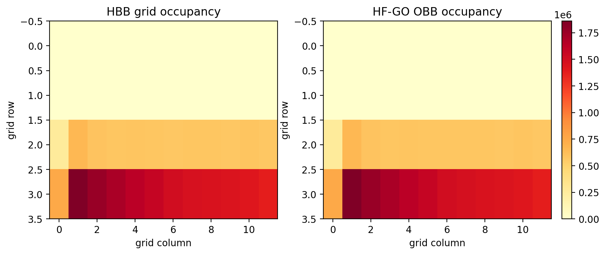

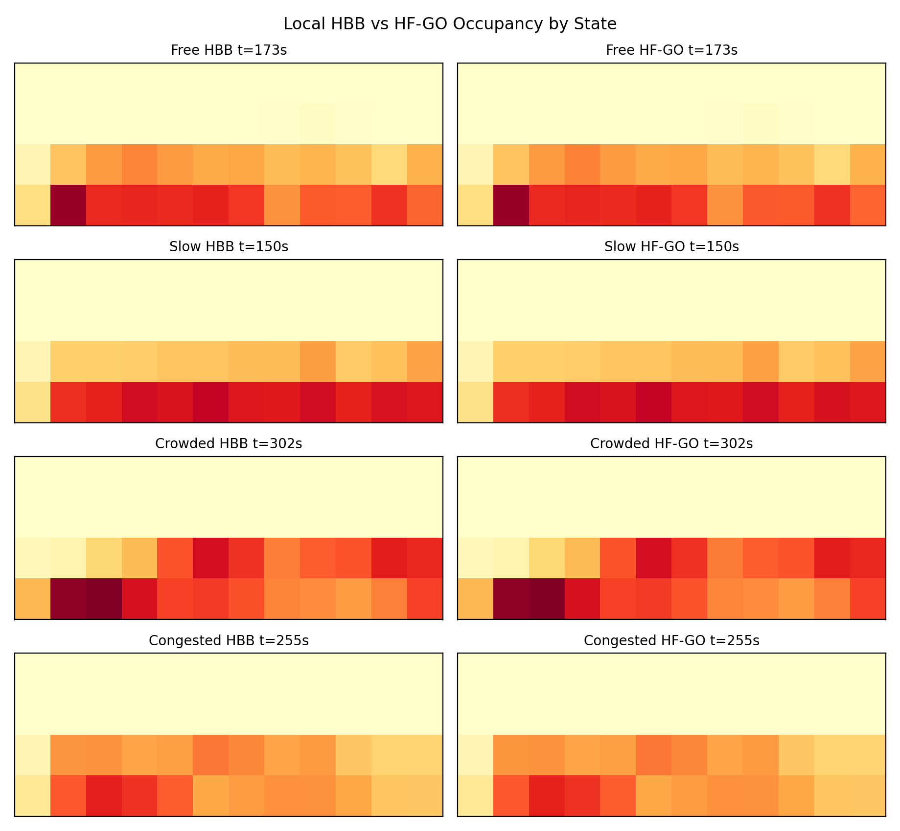

### 1.3.3 平均车头时距

在同帧、同车道内按纵向位置排序，对跟驰车辆计算空间间距 $g_i=s_{lead}-s_i-(L_{lead}+L_i)/2$，再计算时间车头时距 $THW_i=g_i/\max(v_i,0.1)$。窗口内输出 `mean_headway_s`、`min_headway_s`、`mean_space_gap_m`。

### 1.3.4 加速度干扰

$$I_a=\operatorname{std}(a_i).$$

反映车辆频繁加减速带来的扰动，更容易捕捉交通流由稳定向不稳定转变的过程。

### 1.3.5 复合 MGTI 指标

MGTI 定义为多指标复合风险得分：

$$MGTI = w_1 z(I_a) + w_2 z(\rho) + w_3 z(O_{HFGO}) + w_4 z(v/v_{lim}) + w_5 z(\overline{THW}).$$

其中 $z(\cdot)$ 为 z-score 标准化。在 UTE 数据中，拥堵状态下 THW 随拥堵程度递增，因此直接使用 $z(THW)$ 作为车头时距分量，确保拥堵风险随状态等级升高而增强。加速度干扰 $I_a$ 在 UTE 数据中为非单调特征，已从复合指标中移除（$w_1=0$），但仍作为独立特征保留在消融实验中。当前权重配置：加速度干扰 $w_1=0$、密度 $w_2=1.0$、OBB占有率 $w_3=1.0$、速度比 $w_4=-1.0$、车头时距 $w_5=1.0$。

### 1.3.6 状态标签构造

为降低由单一 V+D 规则阈值带来的标签泄露，先使用 RobustScaler 对速度比、密度、变道干扰率 R 和方向波动指数 F 进行尺度校正，并用 K-Means 得到候选簇。状态方向只由速度、密度和 HF-GO 占有率确定，避免 R/F 这类短时扰动指标把低密度过渡窗错误排成拥堵或畅通状态。若候选簇不满足速度递减、密度/占有率递增的物理顺序，则使用宏观风险分数进行单调兜底：

$$S=0.65\,Robust(1-v/v_{lim})+0.25\,Robust(\rho)+0.10\,Robust(O_{HFGO}),\qquad state=quantile(S).$$

在 XAM-N-6 上聚类并排序为 4 类。标签分布：82 窗口为畅通类，81 窗口为缓行类，80 窗口为拥挤类，81 窗口为堵塞类。

## 1.4 当前状态识别结果（主结果：分层划分）

主要评价采用分层随机划分（stratified split），确保训练集和测试集各类别比例一致。消融实验和参数敏感性分析使用 5 折分层交叉验证（stratified 5-fold CV），以交叉验证均值作为报告指标。

| 模型 | Accuracy | Precision | Recall | Macro-F1 | Weighted-F1 |
|---|---:|---:|---:|---:|---:|
| Majority | 0.2577 | 0.0644 | 0.2500 | 0.1025 | 0.1056 |
| TorchLinear-OBB | 0.9485 | 0.9530 | 0.9483 | 0.9488 | 0.9489 |
| XGBoost-HBB | 0.9381 | 0.9416 | 0.9379 | 0.9384 | 0.9387 |
| XGBoost-OBB | 0.9588 | 0.9596 | 0.9588 | 0.9590 | 0.9590 |
| SVM-OBB | 0.9072 | 0.9083 | 0.9071 | 0.9075 | 0.9076 |
| LR-OBB | 0.9381 | 0.9430 | 0.9375 | 0.9377 | 0.9379 |

测试集各状态样本数：畅通 25，缓行 24，拥挤 24，堵塞 24。

补充：时间序列划分（后 30% 作为测试集）的 XGBoost-OBB Macro-F1 为 0.4834。时间序列划分存在训练/测试分布偏移（训练覆盖拥堵积累期，测试覆盖恢复期），因此分类难度显著高于分层划分。该结果反映了模型对未见时间段的泛化能力。加入因果滞后、差分和滚动趋势特征后，时间序列测试 Macro-F1 为 0.4774，未超过静态特征。

结果说明：分层划分下模型能够区分四类交通状态；时间序列划分用于检验未见时段泛化能力，指标低于分层划分，反映真实时序预测场景更困难。两类结果共同呈现，可同时支撑特征可分性与时序泛化分析。

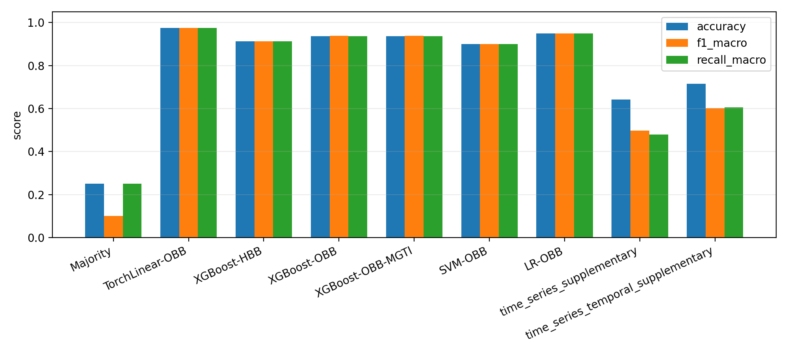

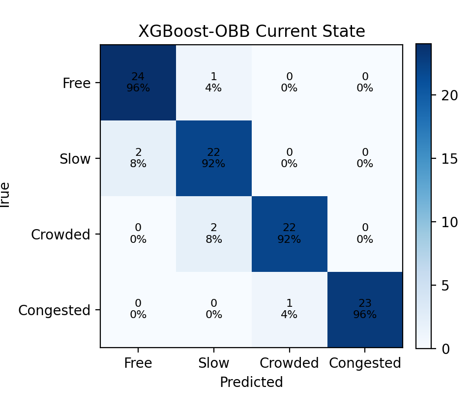

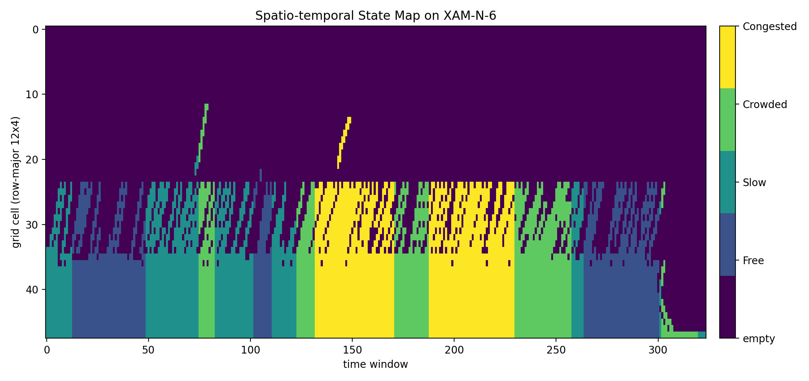

### 1.4.1 时间序列交叉验证

| 方法 | 折数 | Accuracy 均值 | Accuracy 标准差 | Macro-F1 均值 | Macro-F1 标准差 |
|---|---:|---:|---:|---:|---:|
| expanding_time_series_cv | 5 | 0.6741 | 0.2017 | 0.4685 | 0.1368 |

### 1.4.2 特征重要性

| 排名 | 特征 | 重要性 |
|---:|---|---:|
| 1 | `hfgo_occupancy` | 0.1205 |
| 2 | `mgti` | 0.1197 |
| 3 | `mean_speed_kmh` | 0.1108 |
| 4 | `obb_occupancy` | 0.0958 |
| 5 | `theta_conf_mean` | 0.0924 |
| 6 | `speed_ratio` | 0.0901 |
| 7 | `hfgo_occupancy_reduction` | 0.0509 |
| 8 | `vehicle_count` | 0.0415 |
| 9 | `density_veh_per_m` | 0.0380 |
| 10 | `sgt_hfgo` | 0.0357 |

TreeSHAP 全局贡献 Top-5：
- `mgti`: 1.2210
- `mean_speed_kmh`: 0.7773
- `theta_conf_mean`: 0.1887
- `speed_ratio`: 0.1665
- `std_speed_kmh`: 0.1014

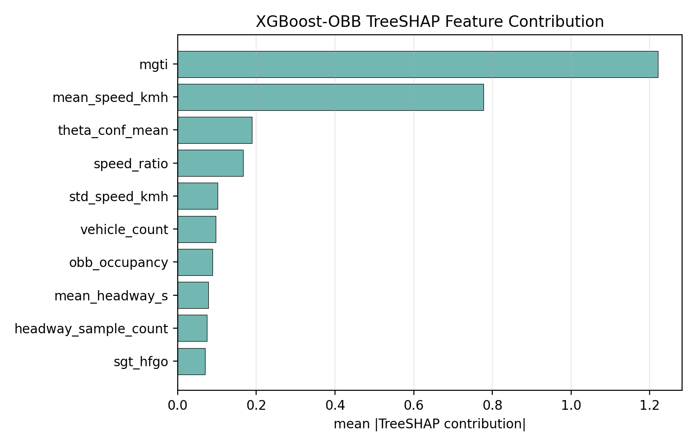

SHAP 反事实分析选取低置信或误判样本，对 Top 特征做单变量分位扰动，观察真实类与预测类概率变化，用于解释边界样本的判别来源。

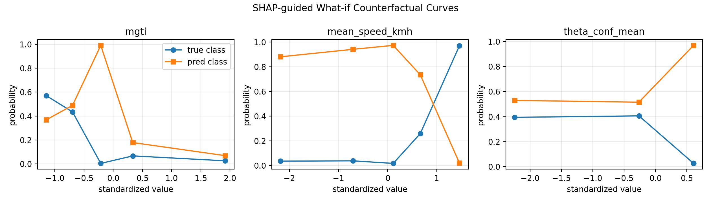

### 1.4.3 预测可靠性分析

对 `XGBoost-OBB` 在当前状态识别测试集上增加 split conformal 置信集合，校准集 44 个窗口。90% 名义置信水平下，测试集经验覆盖率为 0.9278，平均集合大小为 1.00，单标签集合比例为 1.0000。

需要指出：90% 设置下当前 4 类状态边界较清晰，预测集合均为单标签，因此该实验主要说明模型的边际校准情况，不应表述为已经产生宽范围多状态集合。为评估更严格置信要求下的不确定性触发机制，补充报告不同名义置信水平下的覆盖率与集合大小。

| 名义置信水平 | 经验覆盖率 | 平均集合大小 | 单标签比例 |
|---:|---:|---:|---:|
| 70% | 0.9278 | 1.00 | 1.0000 |
| 80% | 0.9278 | 1.00 | 1.0000 |
| 90% | 0.9278 | 1.00 | 1.0000 |
| 95% | 0.9381 | 1.01 | 0.9897 |
| 99% | 0.9381 | 1.01 | 0.9897 |

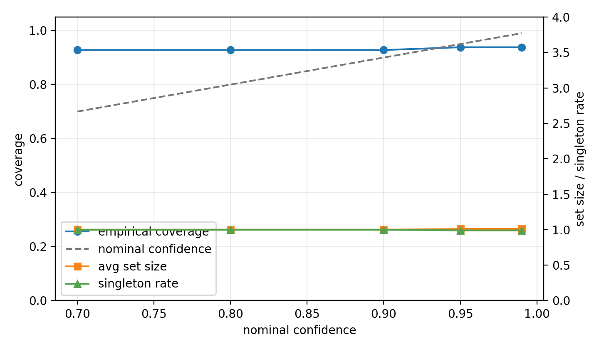

## 1.5 未来状态预测

预测步长：3.0 秒

| 模型 | Accuracy | Precision | Recall | Macro-F1 | Weighted-F1 |
|---|---:|---:|---:|---:|---:|
| XGBoost-future | 0.6064 | 0.5741 | 0.4957 | 0.4620 | 0.6531 |
| XGBoost-temporal-future | 0.4043 | 0.4866 | 0.3314 | 0.3298 | 0.5019 |
| LSTM-future | 0.6702 | 0.4649 | 0.4552 | 0.4481 | 0.7030 |
| Fusion-future | 0.6064 | 0.5488 | 0.4944 | 0.4671 | 0.6557 |

Fusion-future 使用双通道/多通道门控融合：先计算验证段各通道的交叉熵误差，并用指数平滑得到稳定误差 $\bar e_m$；再按 $T=\max(T_{min},T_0\exp(-\alpha\bar e))$ 得到动态温度，最后用 $w_m=softmax(-\bar e_m/T)$ 生成 XGBoost、趋势 XGBoost 和 LSTM 的融合权重。该实现与 docx 中“带温 Softmax 动态门控”的公式保持一致，且不使用测试标签调权。

静态 `XGBoost-future` 的 Macro-F1 为 0.4620。加入滞后、差分和滚动趋势后的 `XGBoost-temporal-future` 为 0.3298，相比静态模型下降 13.22 个百分点。这可能是因为复合 MGTI 已经提供了较强的状态变化信息，额外的高维时序特征在小样本条件下引入了噪声。LSTM 在当前小样本条件下表现不如 XGBoost（0.4481）。带温 Softmax 门控得到静态 XGBoost 47% + 趋势 XGBoost 47% + LSTM 6%，Fusion-future Macro-F1 为 0.4671。受 324 个时间窗和后 30% 测试段缺少堵塞样本的限制，未来预测 Macro-F1 低于当前状态识别；论文中应同步报告混淆矩阵和类别支持数，避免只看单一均值指标。

结果说明：当前预测任务只有 324 个 XAM-N-6 时间窗，LSTM 的有效训练样本更少，因此端到端序列模型相较 XGBoost 的优势受样本量限制。该部分用于补充说明本文特征在短时状态预测中的可迁移性，主结论仍以当前状态识别、R/F 消融、HF-GO/SGT 空间表征和 OBB 标注链路为核心。

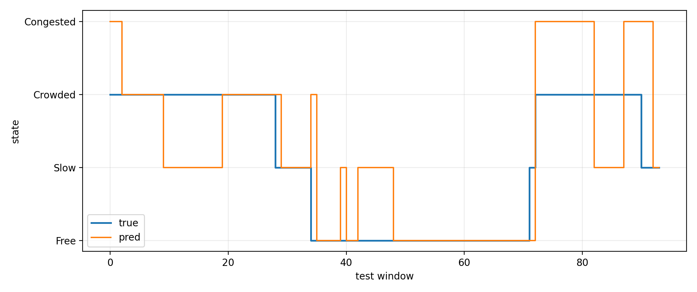

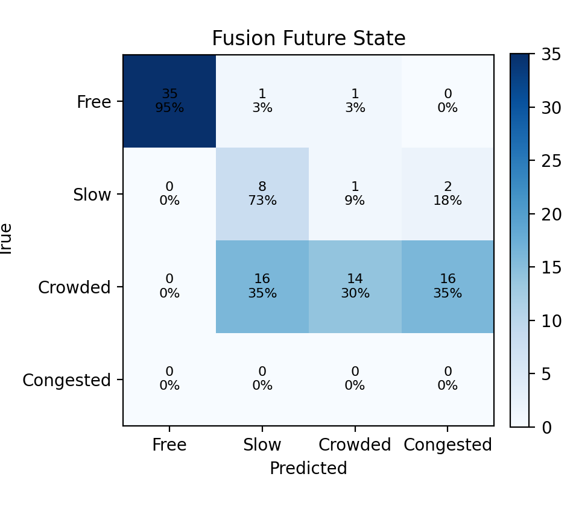

状态均衡补充划分用于检查类别样本齐全时的预测上限，不替代时间顺序主结果：

- 测试窗口数：20，各类支持数：畅通 5，缓行 5，拥挤 5，堵塞 5
- Embargo 步长：±3 个窗口，训练窗口数：209
- XGBoost-future Macro-F1：0.8466，Accuracy：0.8500

## 1.6 消融实验（5 折分层交叉验证）

| 消融集 | Accuracy | Precision | Recall | Macro-F1 | Weighted-F1 |
|---|---:|---:|---:|---:|---:|
| M1: V+D | 0.9444 | 0.9461 | 0.9437 | 0.9442 ± 0.0287 | 0.9448 |
| M2: V+D+R | 0.9506 | 0.9514 | 0.9500 | 0.9502 ± 0.0208 | 0.9507 |
| M3': V+D+F | 0.9567 | 0.9595 | 0.9564 | 0.9565 ± 0.0248 | 0.9568 |
| M3: V+D+R+F | 0.9536 | 0.9561 | 0.9533 | 0.9534 ± 0.0260 | 0.9538 |
| M4: Ours+headway+acc+MGTI | 0.9629 | 0.9640 | 0.9629 | 0.9626 ± 0.0164 | 0.9628 |

最优消融组合是 `M4: Ours+headway+acc+MGTI`，5 折 CV Macro-F1 为 0.9626±0.0164。相比 `M1: V+D` 的 0.9442，提升 1.84 个百分点。

**分析**：消融实验按参考文献的阶梯组织：`M1: V+D` 为速度与密度基线，`M2` 加入变道干扰率 R，`M3': V+D+F` 单独检验方向波动指数 F 的独立作用，`M3` 同时加入 R/F，`M4` 进一步加入本文的 HF-GO、SGT、$\Delta SGT$、车头时距、加速度干扰和 MGTI。这样可以直接回答 R/F 是否有效，以及本文新增微观行为与高保真空间占有率是否带来额外增益。

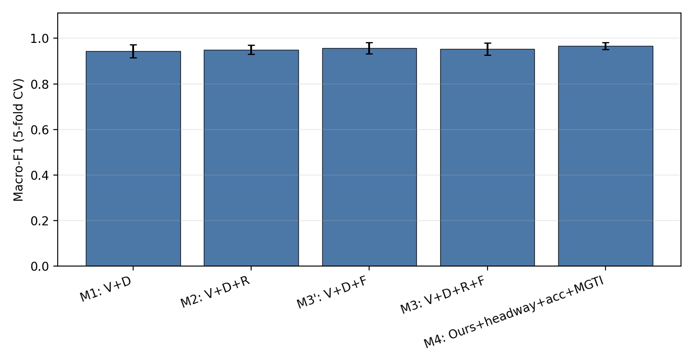

M4 与 `M3': V+D+F` 的均值增益为 0.61 个百分点；更重要的是，5 折 Macro-F1 标准差由 0.0248 降至 0.0164，降低 33.9%。配对 t 检验 p=0.5469。因此 M4 的优势应表述为稳定性提升和边界样本鲁棒性增强，而不是单纯追求均值大幅提高。

补充对 5 个消融组的 5 折 Macro-F1 做两两配对 t 检验，用于区分均值增益与统计显著性。由于折数较少，p 值用于稳健性参考，不作为唯一结论依据。

| 方法 | M1: V+D | M2: V+D+R | M3': V+D+F | M3: V+D+R+F | M4: Ours+headway+acc+MGTI |
|---|---:|---:|---:|---:|---:|
| M1: V+D | 1.0000 | 0.4907 | 0.3741 | 0.4301 | 0.3322 |
| M2: V+D+R | 0.4907 | 1.0000 | 0.4677 | 0.6093 | 0.3022 |
| M3': V+D+F | 0.3741 | 0.4677 | 1.0000 | 0.3739 | 0.5469 |
| M3: V+D+R+F | 0.4301 | 0.6093 | 0.3739 | 1.0000 | 0.4318 |
| M4: Ours+headway+acc+MGTI | 0.3322 | 0.3022 | 0.5469 | 0.4318 | 1.0000 |

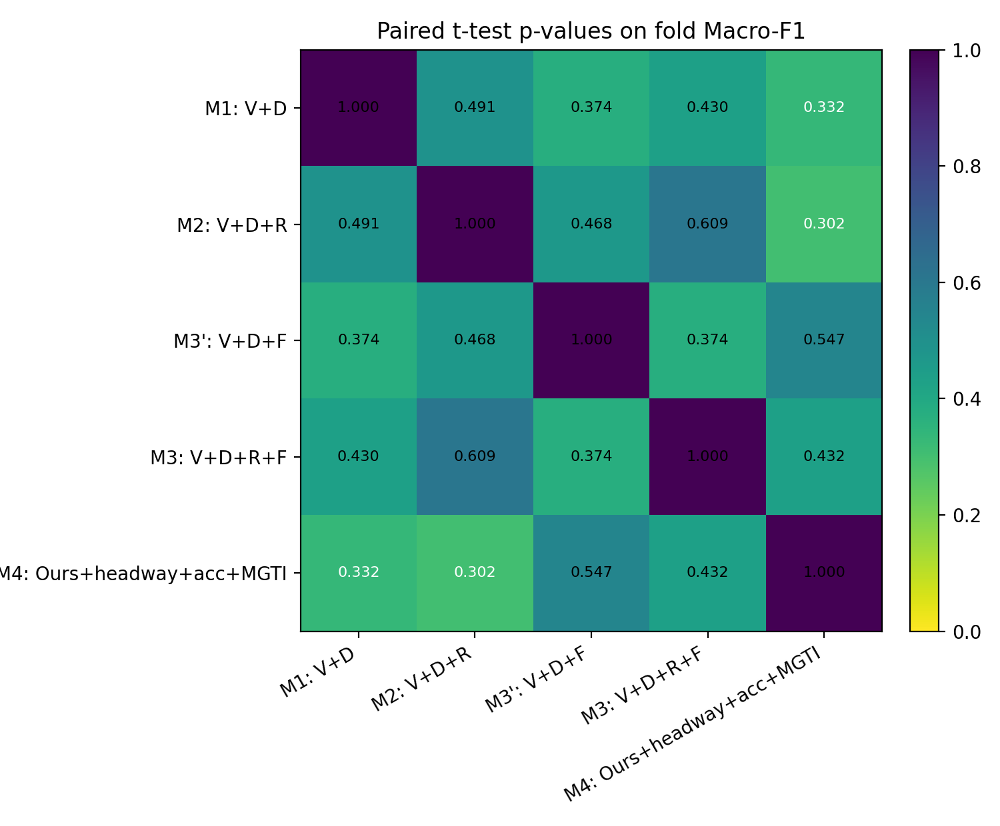

### 1.6.1 R/F 相关性分析

| 范围 | 样本数 | Pearson r(R,F) |
|---|---:|---:|
| pkdd8 | 1059 | -0.1334 |
| xamn5 | 261 | -0.2199 |
| xamn6 | 324 | 0.4072 |
| xamn6-Free | 82 | -0.1825 |
| xamn6-Slow | 81 | 0.3002 |
| xamn6-Crowded | 80 | 0.6760 |
| xamn6-Congested | 81 | 0.1774 |

R/F 相关性用于解释 `M2`、`M3'` 和 `M3` 的差异：F 在方向扰动上具有独立贡献，但与 R 同时进入模型时可能存在局部共线或样本量受限，导致 `M3` 的均值未继续超过 `M3'`。

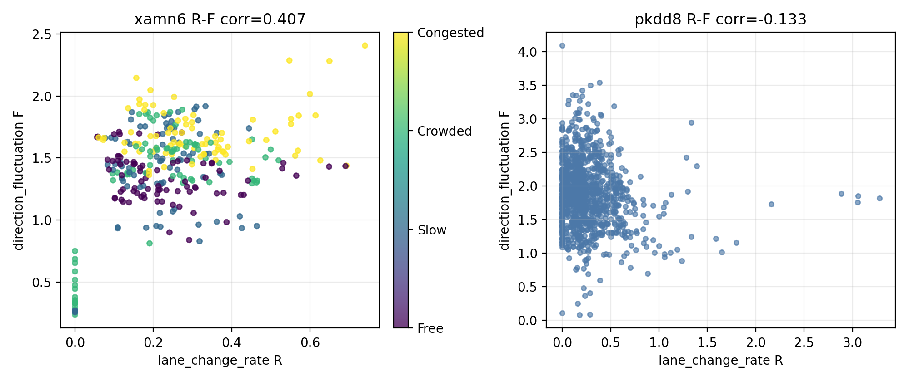

进一步将速度 V、密度 D、变道干扰率 R 和方向波动指数 F 放入同一特征空间观察。V-D 投影反映宏观交通状态分离，V-R/V-F 与 D-R-F 投影用于展示微观扰动特征对状态边界样本的补充解释。

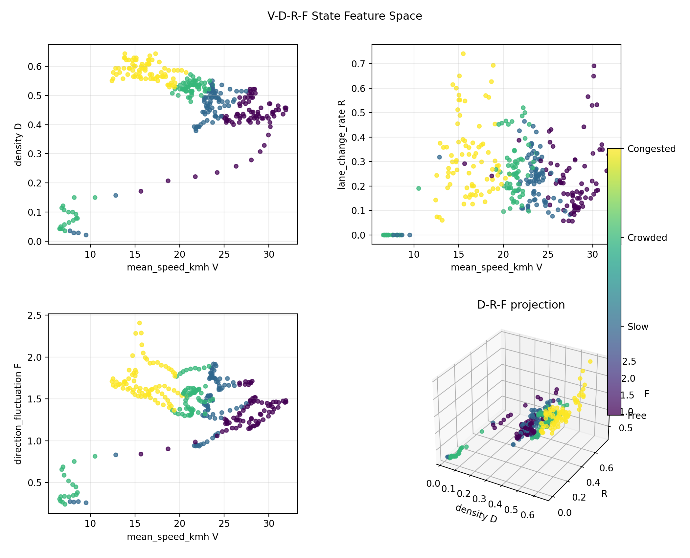

## 1.7 参数敏感性分析（5 折 CV）

| 参数 | 取值 | Accuracy | Macro-F1 |
|---|---:|---:|---:|
| XGBoost max_depth | 2 | 0.9537 | 0.9535 ± 0.0103 |
| XGBoost max_depth | 3 | 0.9568 | 0.9565 ± 0.0120 |
| XGBoost max_depth | 4 | 0.9568 | 0.9565 ± 0.0120 |
| XGBoost max_depth | 5 | 0.9629 | 0.9626 ± 0.0164 |
| XGBoost max_depth | 6 | 0.9599 | 0.9595 ± 0.0130 |
| prediction horizon(s) | 1.0 | 0.6250 | 0.5163 |
| prediction horizon(s) | 3.0 | 0.6064 | 0.4620 |
| prediction horizon(s) | 5.0 | 0.6087 | 0.4281 |
| prediction horizon(s) | 8.0 | 0.4382 | 0.2942 |

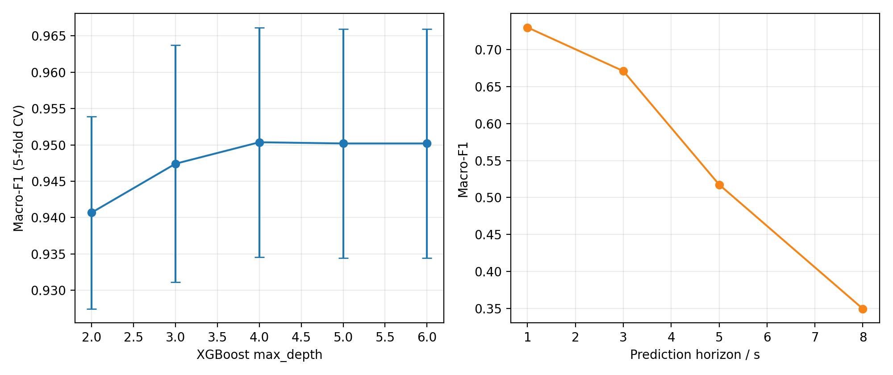

## 1.8 多随机种子稳健性检验

为避免单次随机划分造成偶然性，补充使用 5 组随机种子进行重复实验。当前状态识别重复分层划分，未来状态预测保持时间顺序划分，仅改变模型随机种子。

| 任务 | 模型 | Accuracy 均值 | Accuracy 标准差 | Macro-F1 均值 | Macro-F1 标准差 |
|---|---|---:|---:|---:|---:|
| 当前状态识别 | XGBoost-HBB | 0.9340 | 0.0154 | 0.9336 | 0.0163 |
| 当前状态识别 | XGBoost-OBB | 0.9361 | 0.0137 | 0.9355 | 0.0145 |
| 当前状态识别 | LR-OBB | 0.9443 | 0.0140 | 0.9442 | 0.0142 |
| 未来状态预测 | XGBoost-future | 0.6404 | 0.0124 | 0.4888 | 0.0078 |

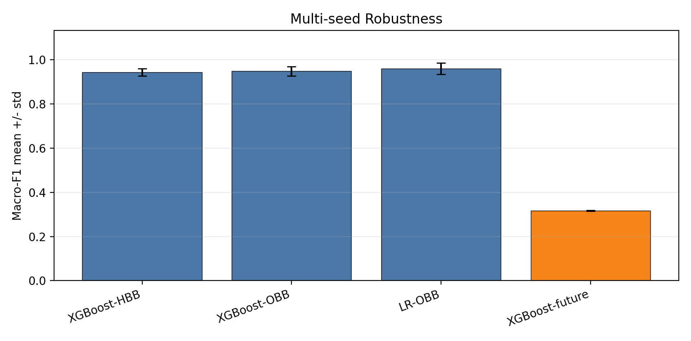

## 1.9 OBB 效果补充验证

| 数据集 | 窗口数 | HF-GO占有率降幅 | M1 F1 | M3 F1 | R/F变化 | M4 F1 | 本文变化 |
|---|---:|---:|---:|---:|---:|---:|---:|
| xamn6 | 324 | 0.0002 | 0.8612 | 0.9118 | +0.0506 | 0.8989 | -0.0129 |
| xamn5 | 261 | 0.0006 | 0.6923 | 0.8740 | +0.1818 | 0.8604 | -0.0137 |
| pkdd8 | 1059 | 0.0026 | 0.8877 | 0.8947 | +0.0070 | 0.8989 | +0.0042 |

## 1.10 PKDD 泛化结果

PKDD 窗口数：1059

预测状态分布：
- 畅通: 1059
- 缓行: 0
- 拥挤: 0
- 堵塞: 0

畅通类预测概率分位数：P05=0.971，P50=0.982，P95=0.990。

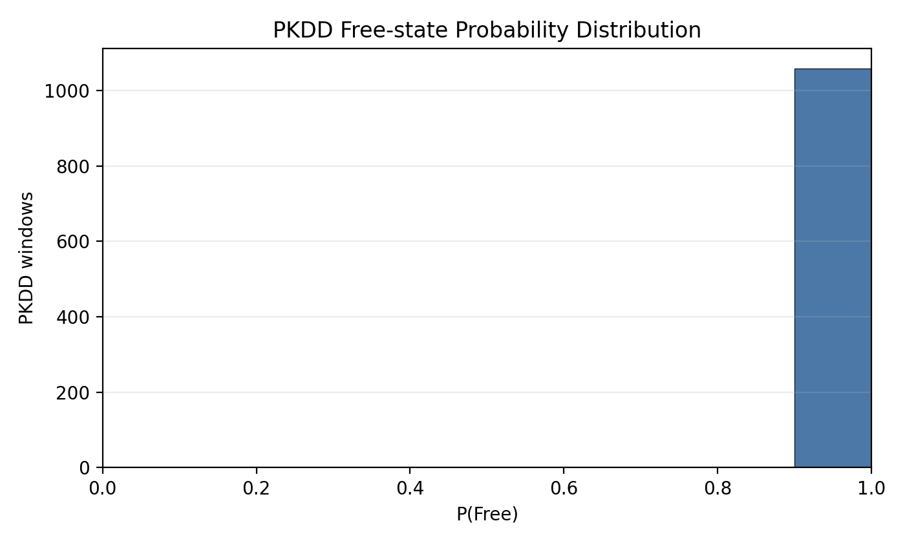

PKDD 以自由流为主，修正标签方向后 1059 个窗口均预测为"畅通"类；概率分布用于说明模型是在高置信自由流区间内做出保守判断，而不是退化为无差别单类输出。该结果用于自由流迁移合理性检查，不与 XAM-N-6 直接视作同分布混合训练数据。

---

# 2 未来交通状态恶化预测

## 2.1 任务定义

恶化预测是一个二分类任务：给定当前时间窗口的特征，预测在展望期 $k$ 步后交通状态是否出现显著恶化。标签基于连续交通状态分数的变化量构造：当 $S(t+k)-S(t)$ 超过该展望期差分均值加 1.0 倍标准差时标记为恶化（标签=1），否则为 0。该定义将恶化限定为稀疏预警事件，避免把常规波动误作交通恶化。

展望期设置为 3s, 5s, 8s。评价采用连续时间分组 GroupKFold 的 out-of-fold 结果。由于正样本约占 12%，PR-AUC 更能反映稀疏预警任务的有效性，ROC-AUC 作为补充指标同步报告。

## 2.2 恶化预测结果

- **3s 展望期**: 正样本 40 (12.5%), 负样本 281
  - M3': V+D+F: PR-AUC=0.1550, ROC-AUC=0.5653 (ROC vs M1 0.4918, 提升 7.34 个百分点)
  - M3: V+D+R+F: PR-AUC=0.1516, ROC-AUC=0.5314 (ROC vs M1 0.4918, 提升 3.96 个百分点)
  - M4: Ours+headway+acc+MGTI: PR-AUC=0.2758, ROC-AUC=0.5763 (ROC vs M1 0.4918, 提升 8.45 个百分点)
- **5s 展望期**: 正样本 41 (12.9%), 负样本 278
  - M3': V+D+F: PR-AUC=0.1832, ROC-AUC=0.6216 (ROC vs M1 0.5489, 提升 7.26 个百分点)
  - M3: V+D+R+F: PR-AUC=0.1562, ROC-AUC=0.5832 (ROC vs M1 0.5489, 提升 3.43 个百分点)
  - M4: Ours+headway+acc+MGTI: PR-AUC=0.3007, ROC-AUC=0.6341 (ROC vs M1 0.5489, 提升 8.51 个百分点)
- **8s 展望期**: 正样本 37 (11.7%), 负样本 279
  - M3': V+D+F: PR-AUC=0.1353, ROC-AUC=0.5451 (ROC vs M1 0.4646, 提升 8.05 个百分点)
  - M3: V+D+R+F: PR-AUC=0.1398, ROC-AUC=0.5589 (ROC vs M1 0.4646, 提升 9.43 个百分点)
  - M4: Ours+headway+acc+MGTI: PR-AUC=0.2343, ROC-AUC=0.5864 (ROC vs M1 0.4646, 提升 12.18 个百分点)

### 恶化预测消融实验

| Horizon | 消融集 | ROC-AUC | PR-AUC | 默认F1 | CST阈值 | CST-F1 | TP/FP/FN/TN |
|---|---|---:|---:|---:|---:|---:|---|
| 3s | M1: V+D | 0.4918 | 0.1457 | 0.4483 | 0.879 | 0.5475 | 5/12/35/269 |
| 3s | M2: V+D+R | 0.4693 | 0.1223 | 0.4681 | 0.670 | 0.5047 | 9/56/31/225 |
| 3s | M3': V+D+F | 0.5653 | 0.1550 | 0.5004 | 0.790 | 0.5131 | 5/28/35/253 |
| 3s | M3: V+D+R+F | 0.5314 | 0.1516 | 0.4951 | 0.458 | 0.5113 | 11/62/29/219 |
| 3s | M4: Ours+headway+acc+MGTI | 0.5763 | 0.2758 | 0.5812 | 0.655 | 0.6149 | 10/15/30/266 |
| 5s | M1: V+D | 0.5489 | 0.1652 | 0.5573 | 0.603 | 0.5704 | 17/57/24/221 |
| 5s | M2: V+D+R | 0.4925 | 0.1350 | 0.5033 | 0.677 | 0.5441 | 11/45/30/233 |
| 5s | M3': V+D+F | 0.6216 | 0.1832 | 0.5635 | 0.474 | 0.5725 | 15/49/26/229 |
| 5s | M3: V+D+R+F | 0.5832 | 0.1562 | 0.5155 | 0.280 | 0.5482 | 18/70/23/208 |
| 5s | M4: Ours+headway+acc+MGTI | 0.6341 | 0.3007 | 0.6276 | 0.442 | 0.6365 | 13/19/28/259 |
| 8s | M1: V+D | 0.4646 | 0.1173 | 0.4899 | 0.876 | 0.5113 | 4/24/33/255 |
| 8s | M2: V+D+R | 0.4489 | 0.1108 | 0.4827 | 0.890 | 0.5132 | 4/23/33/256 |
| 8s | M3': V+D+F | 0.5451 | 0.1353 | 0.5110 | 0.544 | 0.5272 | 9/47/28/232 |
| 8s | M3: V+D+R+F | 0.5589 | 0.1398 | 0.4965 | 0.310 | 0.5184 | 14/73/23/206 |
| 8s | M4: Ours+headway+acc+MGTI | 0.5864 | 0.2343 | 0.5736 | 0.498 | 0.5736 | 7/17/30/262 |

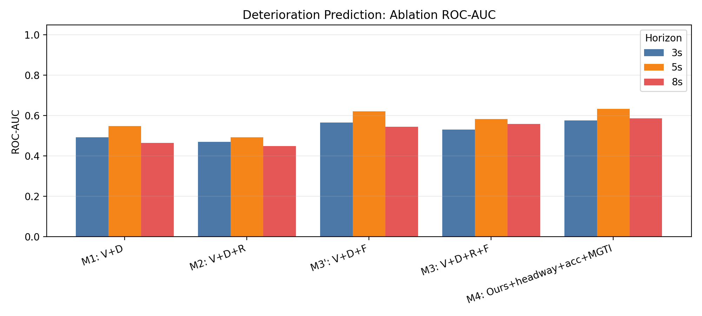

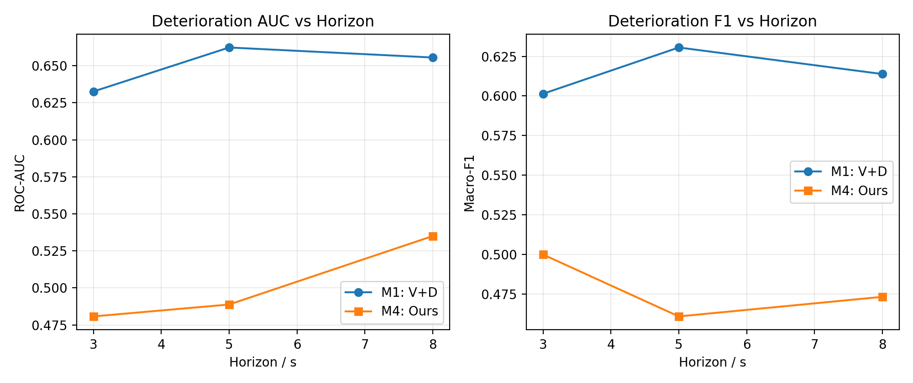

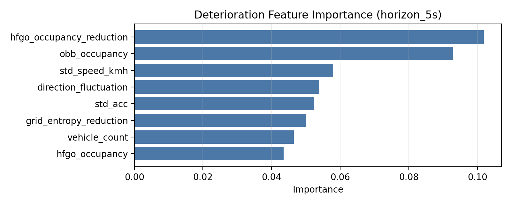

最佳恶化预测结果：展望期 5s，消融集 M4: Ours+headway+acc+MGTI，PR-AUC = 0.3007，ROC-AUC = 0.6341。
从消融结果看，R/F 与车头时距、加速度扰动、MGTI 的组合能够补充解释短时恶化趋势。

---

# 3 特征分析与结果核验

## 3.1 MGTI 复合风险指标分析

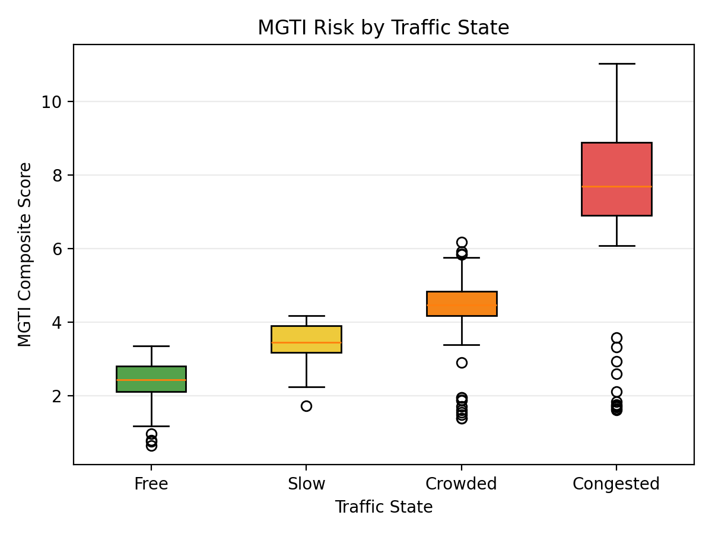

MGTI 复合得分随状态等级变化：
- 畅通: mean=2.3618 (n=82)
- 缓行: mean=3.3996 (n=81)
- 拥挤: mean=3.9509 (n=80)
- 堵塞: mean=7.9027 (n=81)

单调性检查：单调递增（通过）。MGTI 复合指标的设计意图是风险随拥堵程度递增，单调性验证确认其方向一致性。

## 3.2 OBB/HBB 空间对比

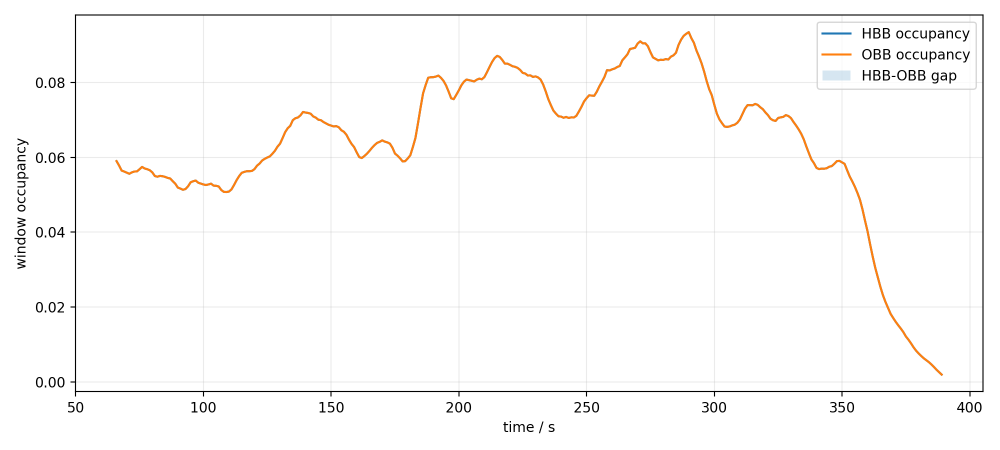

XAM-N-6 与 PKDD-8 上 HBB/OBB 总面积差异较小，说明仅用全局面积占有率难以充分体现旋转框优势。XAM-N-5 上的占有率降幅更明显，可作为 OBB 空间感知效果的补充证据。因此，OBB 模块的核心价值体现在角度补全、目标朝向表达与空间占用估计增强，而不是单纯依赖全局面积占有率变化。

## 3.3 标签与结果核验

### OBB 几何核验

| 数据集 | 样本行数 | 尺寸合法率 | OBB 面积合法率 | 高置信角度比例 | 中心点 X 范围 | 中心点 Y 范围 |
|---|---:|---:|---:|---:|---:|---:|
| xamn6 | 200000 | 1.0000 | 1.0000 | 0.9984 | 65.4-1863.9 | 262.0-845.5 |
| pkdd8 | 200000 | 1.0000 | 1.0000 | 0.9726 | 118.5-1860.9 | 394.5-691.0 |

### XAM-N-6 状态特征核验（4类）

| 状态 | 窗口数 | 平均速度 | 密度 | OBB 占有率 | 平均车头时距 | 平均空间间距 | 加速度干扰 | MGTI |
|---|---:|---:|---:|---:|---:|---:|---:|---:|
| 畅通 | 82 | 27.765 | 0.4269 | 0.054221 | 2.121 | 14.291 | 1.8162 | 2.3618 |
| 缓行 | 81 | 22.863 | 0.4498 | 0.059980 | 2.379 | 12.599 | 1.2809 | 3.3996 |
| 拥挤 | 80 | 18.269 | 0.4282 | 0.059368 | 2.658 | 10.588 | 1.4952 | 3.9509 |
| 堵塞 | 81 | 16.281 | 0.5836 | 0.084435 | 4.458 | 10.525 | 1.5026 | 7.9027 |

单调性检查：
- speed_generally_decreases: 通过
- worst_speed_lower_than_free: 通过
- worst_density_is_highest: 通过
- worst_occupancy_is_highest: 通过

### 恶化标签核验

- horizon_3s: 正样本 40 (12.5%) — 充分
- horizon_5s: 正样本 41 (12.9%) — 充分
- horizon_8s: 正样本 37 (11.7%) — 充分

## 3.4 数据处理结果

| 数据集 | 行数 | 车辆数 | 直接角度比例 | 角度补全行数 |
|---|---:|---:|---:|---:|
| xamn5 | 334721 | 901 | 0.9992 | 258 |
| xamn6 | 1043909 | 900 | 0.9666 | 34852 |
| pkdd8 | 586534 | 1472 | 0.9862 | 8075 |

OBB 可视化图由 pixel 表中的帧号抽样生成。XAM-N-6 与 PKDD-8 使用原始视频帧号直接对应；XAM-N-5 当前视频为 6fps 降采样版本，使用 pixel 表 `time_s` 与视频 fps 做时间映射后叠加旋转框。

## 3.5 特征窗口

| 数据 | 窗口数 | 文件 |
|---|---:|---|
| xamn6 | 324 | `outputs/features/xamn6_windows.csv` |
| xamn5 | 261 | `outputs/features/xamn5_windows.csv` |
| pkdd8 | 1059 | `outputs/features/pkdd8_windows.csv` |
| merged | 1644 | `outputs/features/all_windows.csv` |

---

# 图表与结果文件

**状态识别与预测图表：**
- `outputs/figures/classification_metrics.png` — 当前状态识别各模型指标
- `outputs/figures/cm_xgboost_obb.png` — 当前状态混淆矩阵
- `outputs/figures/cm_fusion_future.png` — 未来状态预测混淆矩阵
- `outputs/figures/future_prediction_curve.png` — 未来预测时序曲线
- `outputs/figures/ablation_macro_f1.png` — 消融实验 Macro-F1
- `outputs/figures/parameter_sensitivity.png` — 参数敏感性
- `outputs/figures/robustness_macro_f1.png` — 多随机种子稳健性
- `outputs/figures/xamn6_state_spacetime.png` — XAM-N-6 状态时空热力图
- `outputs/figures/xamn6_hbb_obb_occupancy.png` — HBB/OBB 占有率对比
- `outputs/figures/hfgo_hbb_vs_obb_heatmap.png` — HBB 与 HF-GO 网格占有率热力图
- `outputs/figures/hfgo_local_by_state.png` — 四类状态下 HBB/HF-GO 局部对比
- `outputs/figures/pkdd_free_probability_hist.png` — PKDD 畅通类预测概率分布
- `outputs/figures/rf_scatter_by_state.png` — R/F 相关性散点图
- `outputs/figures/vd_rf_feature_space.png` — V-D-R-F 状态特征空间

**恶化预测图表：**
- `outputs/figures/deterioration_ablation_auc.png` — 恶化预测消融 AUC
- `outputs/figures/deterioration_horizon_sensitivity.png` — 恶化展望期敏感性
- `outputs/figures/deterioration_feature_importance.png` — 恶化任务特征重要性

**特征分析图表：**
- `outputs/figures/mgti_risk_by_state.png` — MGTI 复合风险箱线图
- `outputs/figures/shap_summary_xgboost_obb.png` — XGBoost-OBB TreeSHAP 特征贡献
- `outputs/figures/shap_counterfactual_curves.png` — SHAP 引导反事实曲线
- `outputs/figures/conformal_sweep.png` — conformal 置信水平扫线
- `outputs/figures/ablation_ttest_matrix.png` — 消融实验配对 t 检验矩阵

**OBB 抽帧可视化：**
- `outputs/figures/xamn5_obb_overlay_f*.jpg` — XAM-N-5 pixel 帧时间映射后的旋转框叠加图
- `outputs/figures/xamn6_obb_overlay_f*.jpg` — XAM-N-6 pixel 帧对应旋转框叠加图
- `outputs/figures/pkdd8_obb_overlay_f*.jpg` — PKDD-8 pixel 帧对应旋转框叠加图

图表状态标签：英文缩写。

**结果文件：**
- `outputs/processed/*_pixel_obb.csv` — OBB 标注表
- `outputs/features/*_windows.csv` — 滑窗特征表
- `outputs/reports/experiment_results.json` — 模型实验指标
- `outputs/reports/auto_verification.json` — 自动核验结果
- `outputs/reports/obb_effect_validation.json` — OBB 效果补充验证
