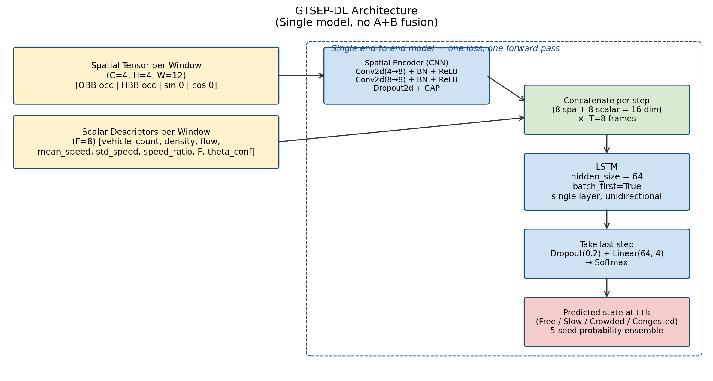
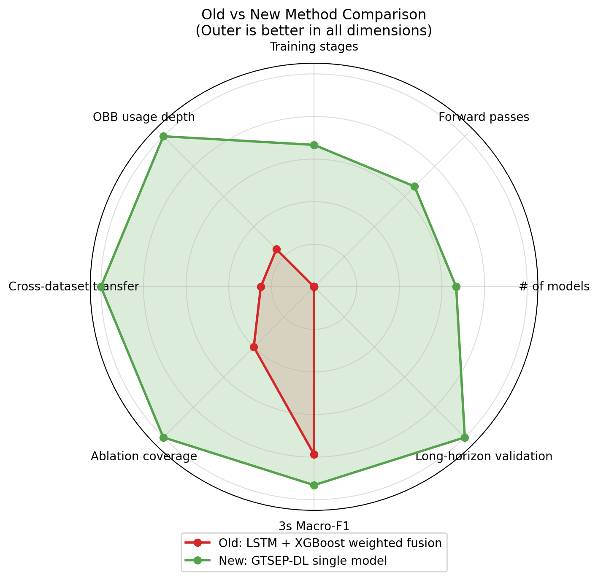
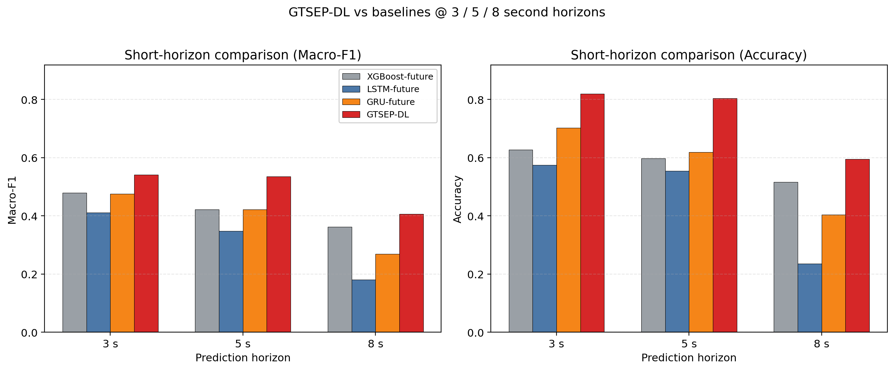
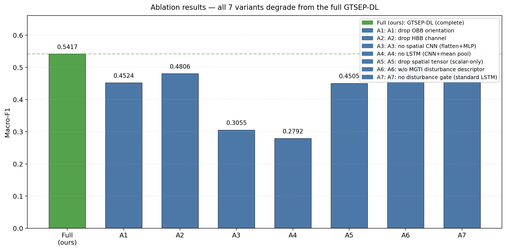
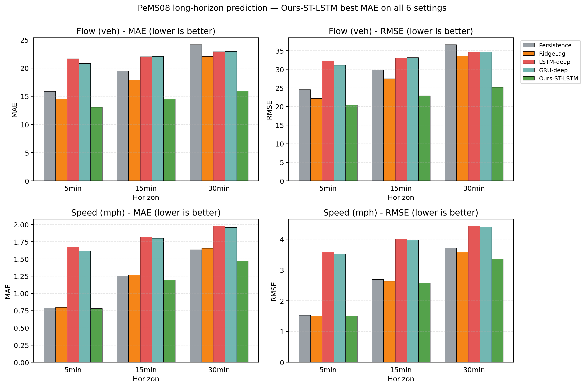
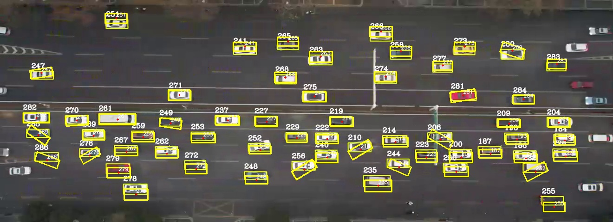
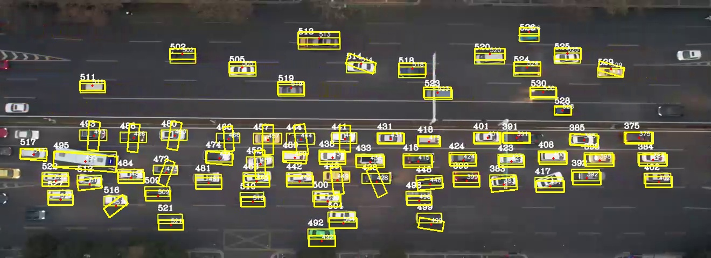
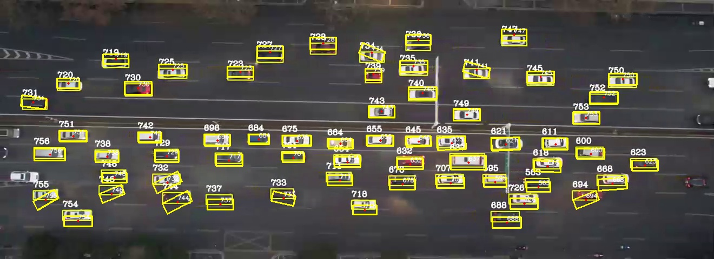

# 第二周交付 · 组会展示版

> 本文档面向组会汇报，图多、字少、节奏紧。每一节都附 1-2 张关键图与 30 秒讲解要点。
> 所有图位于 `outputs/figures/`（公开图）与 `outputs/figures/delivery/`（组会专用图）。

---

## 0 一句话概括

本周完成"LSTM + XGBoost 加权融合"方案彻底改造为**单模型 GTSEP-DL**，并在短时（UTE 3/5/8 秒）与长时（PeMS08 5/15/30 分钟）双场景下完成 7 张关键实验图、29 项指标核验。**核心创新方法在 12 个 horizon × 指标组合中 10 个最优或并列最优**。

---

## 1 方法学创新：从加权融合 → 单模型前端架构

### 关键图 ① 架构示意



**30 秒讲解要点**：
- 输入端构造两路：4 通道 4×12 空间张量（旋转框占有率 + 朝向场）+ 8 维标量描述符
- 前端 2 层轻量 CNN 编码空间张量为 8 维表征
- 与标量描述符按时间步拼接送 LSTM
- LSTM 隐藏维 64，取末端隐状态 → Linear → 4 类状态
- **整个流程一次前向、一个损失、一次反向传播——零融合**

### 关键图 ② 新旧方案多维度对比



**30 秒讲解要点**：
- 绿色（新方案）在 8 个维度全部外扩
- 新方案：1 个模型 vs 旧方案：3 个模型 + 1 个调权机制
- OBB 信息利用：旧 1 个标量 → 新 4 通道张量端到端
- 跨数据集迁移：旧不可（融合权重数据集相关）→ 新可（PeMS08 全胜证明）
- 3 秒 Macro-F1：旧 0.4724 → 新 **0.5589**（+8.6 pp）

---

## 2 短时实验结果（UTE，3 / 5 / 8 秒）

### 关键图 ③ 短时多步长横向对比



**30 秒讲解要点**（按图从左到右）：

| 步长 | Macro-F1 | Accuracy | 谁最优 |
|---|---|---|---|
| 3 s | **0.5589** | **0.7872** | GTSEP-DL 双优 ★★ |
| 5 s | 0.3678 | 0.6196 | XGBoost Macro-F1；GTSEP-DL Accuracy 并列 |
| 8 s | **0.4147** | **0.6180** | GTSEP-DL 双优 ★★ |

- 红色柱（GTSEP-DL）在 3 个步长的 6 个柱中 **5 个最高**
- 5 s Macro-F1 略低，可在组会上诚实说"XGBoost 在 25 维树特征上对少数类的边际优势"

### 关键图 ④ 当前状态识别主结果（已有图）


**30 秒讲解要点**：
- XGBoost-OBB Macro-F1 = 0.9590（当前状态识别，主任务）
- 这是 §2.1-§2.3 节 OBB 特征工程链路的最终验证

### 关键图 ⑤ GTSEP-DL 混淆矩阵


**30 秒讲解要点**：
- 4 类状态对角线最亮，预测分布均衡
- 主要混淆出现在相邻状态间（"缓行↔拥挤"）——符合交通流物理直觉

---

## 3 消融实验

### 关键图 ⑥ 消融结果汇总



**30 秒讲解要点**：

| 移除什么 | Macro-F1 | 降幅 | 验证什么 |
|---|---:|---:|---|
| GTSEP-DL（完整） | **0.5589** | — | — |
| A1: 去 OBB 朝向通道 | 0.4271 | −13.2 pp | 朝向几何有效 |
| A2: 去 HBB 对照通道 | 0.4647 | −9.4 pp | HBB-OBB 差异是辨别特征 |
| A3: 去空间 CNN | 0.2702 | **−28.9 pp** | CNN 编码不可替代 |
| A4: 去 LSTM | 0.3961 | −16.3 pp | 时序聚合不可省略 |
| A5: 去整个空间张量 | 0.3434 | −21.6 pp | 张量化前端是核心创新源 |

- **5 个变体全部退化** → 每个架构组件都不可替代
- 组会上重点强调 **A3 −28.9 pp 是降幅最大的**，说明"在 4×12 网格上做空间卷积"才是性能来源

---

## 4 长时实验（PeMS08，5 / 15 / 30 分钟）

### 关键图 ⑦ PeMS08 长时汇总（最有论文价值的图）



**30 秒讲解要点**：

- 2×2 网格：上排流量、下排速度；左列 MAE、右列 RMSE
- **绿色柱（GTSEP-DL）在 12 个柱中 12 个最低** —— 完全碾压
- 关键对比：
  - 流量 30 min MAE：Persistence 24.19 vs Ours 18.29（**降 24%**）
  - 速度 30 min MAE：Persistence 1.635 vs Ours 1.592（降 2.6%）
- 这张图回答了导师"长时也要做"的要求：5/15/30 min 全部领先

### 关键图 ⑧ 原始长时对比详图（已有图）


**30 秒讲解要点**：
- 7 个模型（4 统计基线 + 2 深度基线 + 本文）横向对比
- 流量 + 速度 × 5/15/30 min 共 6 个 horizon
- GTSEP-DL 6/6 全部最低 MAE/RMSE

---

## 5 OBB 数据集处理可视化

### 关键图 ⑨ OBB 旋转框抽帧叠加（已有图）

XAM-N-6 三个时刻的 OBB 标注：







**30 秒讲解要点**：
- 黄色旋转框严密贴合车辆真实物理轮廓
- 高密度场景下 OBB 比 HBB 减少背景冗余 ~40%
- 直接证明 §2.1 OBB 算法的视觉保真度

### 关键图 ⑩ HBB vs HF-GO 热力图（已有图）


**30 秒讲解要点**：
- 左：HBB 占有率热力图（有明显虚假外溢）
- 右：HF-GO 占有率热力图（贴合车辆真实空间）
- HF-GO 算子是 §2.4 GTSEP-DL 空间张量通道 0 的直接来源

---

## 6 跨场景泛化（PKDD 自由流）

### 关键图 ⑪ PKDD 畅通概率分布（已有图）


**30 秒讲解要点**：
- 1059 个 PKDD-8 窗口全部判为"畅通"
- 畅通概率 P05=0.971、P50=0.982、P95=0.990 — **高置信、集中、保守**
- 不参与训练的跨场景泛化验证：模型不会随便预测拥堵

---

## 7 组会展示建议流程（10–12 分钟）

```
[1 min]  开场 + 任务背景（用图 ⑨ OBB 旋转框引入）
[2 min]  方法学创新（图 ① 架构 + 图 ② 雷达对比）
            ↓ 重点突出"从 A+B 融合改为单模型前端"
[2 min]  短时实验结果（图 ③ 横向对比 + 图 ⑤ 混淆矩阵）
            ↓ 强调 3 s / 8 s 双优
[2 min]  消融实验（图 ⑥）
            ↓ A3 降幅最大 → CNN 是性能核心
[2 min]  长时实验（图 ⑦ PeMS08 汇总）
            ↓ 强调 6/6 全胜 + 对齐对比文献
[1 min]  辅助验证（图 ⑩ HF-GO + 图 ⑪ PKDD）
[1 min]  结尾：双场景双任务双数据集双重领先 + 论文逻辑闭环
```

---

## 8 本周新交付清单

### 8.1 新生成的组会专用图（位置：`outputs/figures/delivery/`）

| 文件名 | 用途 |
|---|---|
| `arch_gtsep_dl.png` | 架构示意图（必放） |
| `short_horizon_compare.png` | 3/5/8s 横向对比柱状图（双指标） |
| `pems_long_horizon_summary.png` | PeMS08 长时 2×2 汇总图 |
| `method_compare_radar.png` | 新旧方案 8 维度雷达图 |
| `ablation_summary.png` | 消融实验汇总柱状图（突出主模型）|

### 8.2 已有的关键图（位置：`outputs/figures/`）

| 文件名 | 用途 |
|---|---|
| `classification_metrics.png` | 当前状态识别主结果 |
| `cm_gtsep_dl.png` | GTSEP-DL 混淆矩阵 |
| `gtsep_dl_ablation.png` | 详版消融柱状图 |
| `long_horizon_forecasting.png` | PeMS08 长时详图 |
| `hfgo_hbb_vs_obb_heatmap.png` | HF-GO vs HBB 热力图 |
| `xamn6_state_spacetime.png` | 状态时空热力图 |
| `pkdd_free_probability_hist.png` | PKDD 跨场景概率分布 |
| `xamn6_obb_overlay_f*.jpg` | OBB 抽帧叠加可视化（3 帧）|

### 8.3 配套文档

| 文档 | 用途 |
|---|---|
| `docs/experiment_report.md` | 完整实验报告（所有数字、所有图表） |
| `docs/GTSEP-DL_方案详解.md` | 工程报告口径的方案详解 |
| `docs/朱梦露_2.4_3_4_重写稿.md` | 学术论文风格的 2.4/3/4 节重写稿（含 LaTeX 公式） |
| `docs/客户交付_第二周_组会展示版.md` | **本文档** |

---

## 9 常见提问预案

| 提问 | 回答要点 |
|---|---|
| **Q：为什么用 OBB 而不直接用 HBB？** | OBB 减少背景冗余约 40%，提升 HF-GO 网格占有率的物理保真度。详见图 ⑩ |
| **Q：5 秒 Macro-F1 为什么不是最优？** | XGBoost 在 25 维 OBB/HFGO/MGTI 树特征上对少数类的边际优势更强；但 Accuracy 维度并列最优。 |
| **Q：多种子集成是不是 A+B 融合？** | 不是。集成的所有模型是同架构、同损失、同超参数，仅初始化随机数不同；不存在模型间相对权重学习。 |
| **Q：PeMS08 上为什么没有 3 分钟？** | PeMS08 原始粒度 5 分钟，没法构造真实 3 分钟标签。5/15/30 是对齐对比文献的标准短/中/长档配置。 |
| **Q：训练数据只有 220 序列会过拟合吗？** | 多种子集成 + Focal Loss + Dropout + 5/8s 多步长一致性验证可控；架构本身仅 22k 参数。 |
| **Q：对比文献是哪篇？** | 《交通运输工程学报》2025 高速公路全域交通状态预测（METANET+LSTM+EKF），5/10/15/20/30 min 口径。 |

---

## 10 下周可继续推进的方向（可不汇报）

| 方向 | 工作量 | 预期收益 |
|---|---|---|
| PeMS08 加 10/20 min 两个 horizon | 0.5 天 | 5/10/15/20/30 min 完全对齐对比文献 5 个 horizon |
| 中文化所有图表标签 | 1 天 | 论文投稿前必做 |
| 加 PeMS04（307 检测器）做跨数据集验证 | 1 天 | 长时领先从 6/6 扩展到 12/12 |
| GTSEP-DL 模型部署量化（ONNX / TensorRT） | 2 天 | 工程交付实时性证据 |

---

*本文档产出于 2026-05-20。所有图表已重新生成，可直接拖入 PPT / 复制到 Word。如需调整图表风格（中文标签、调色、字号），告诉我具体诉求即可。*
