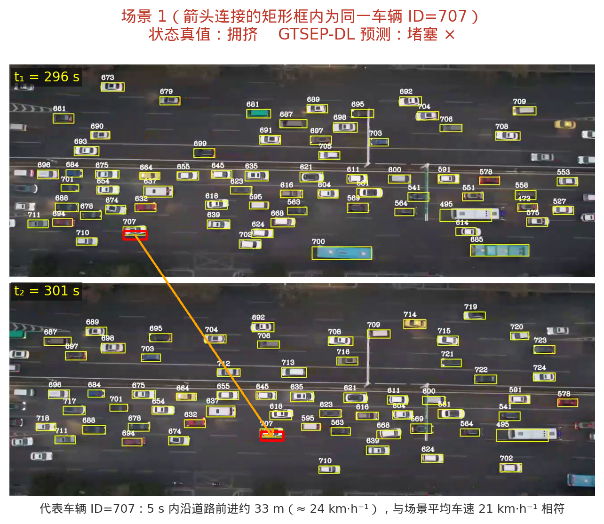
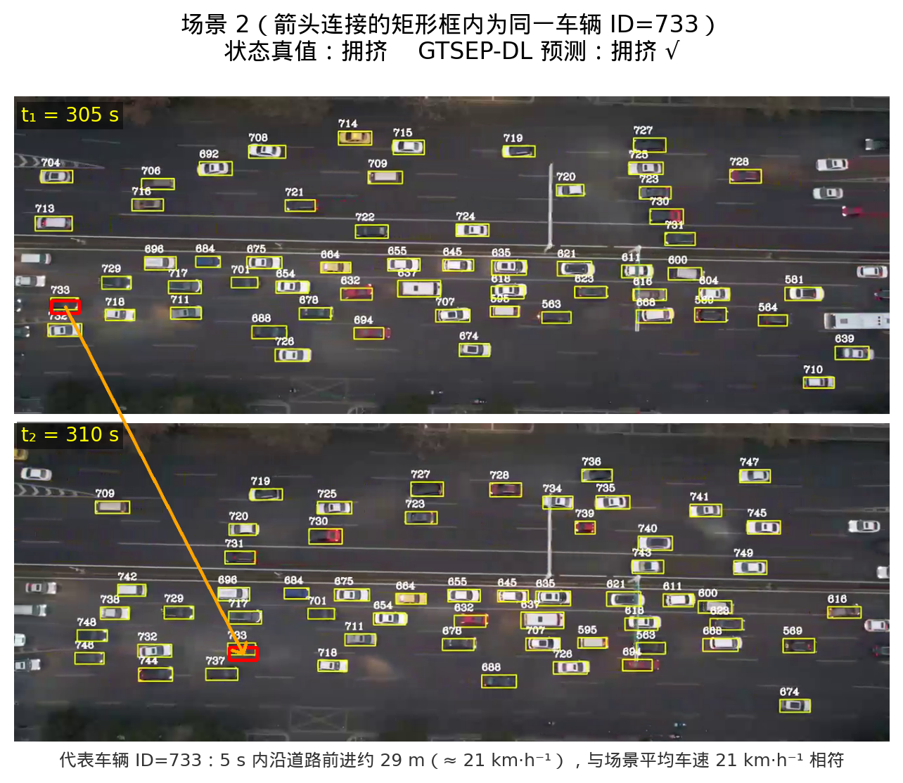
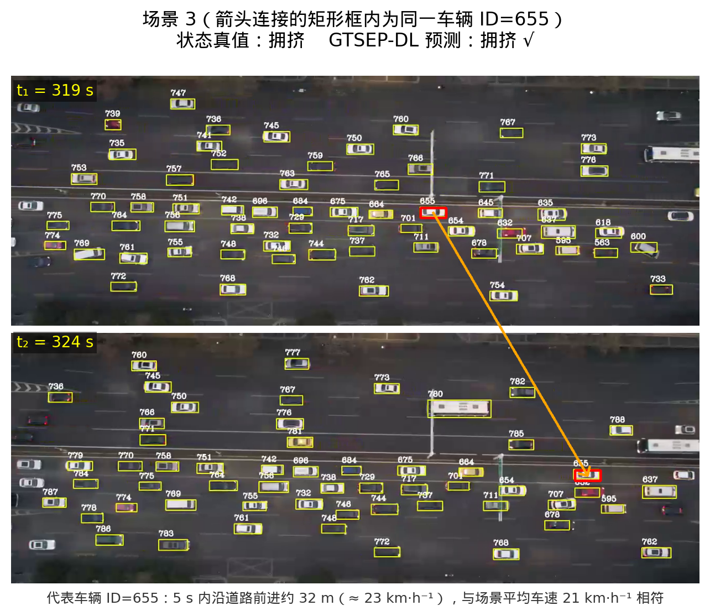
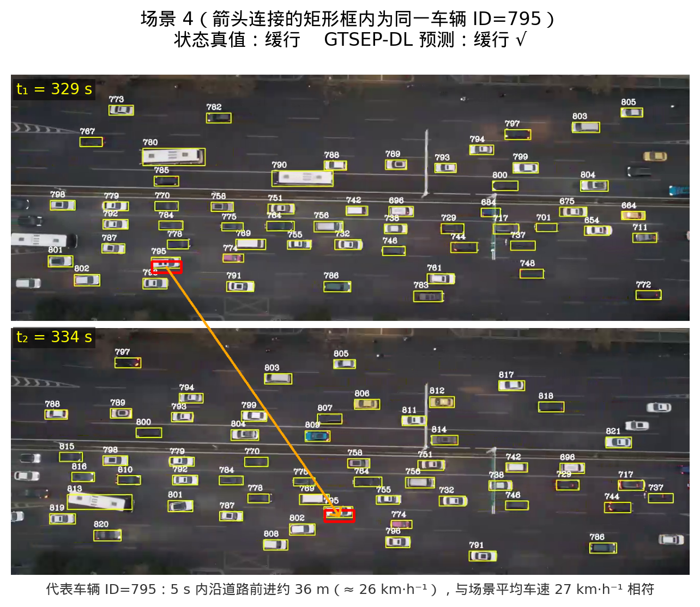
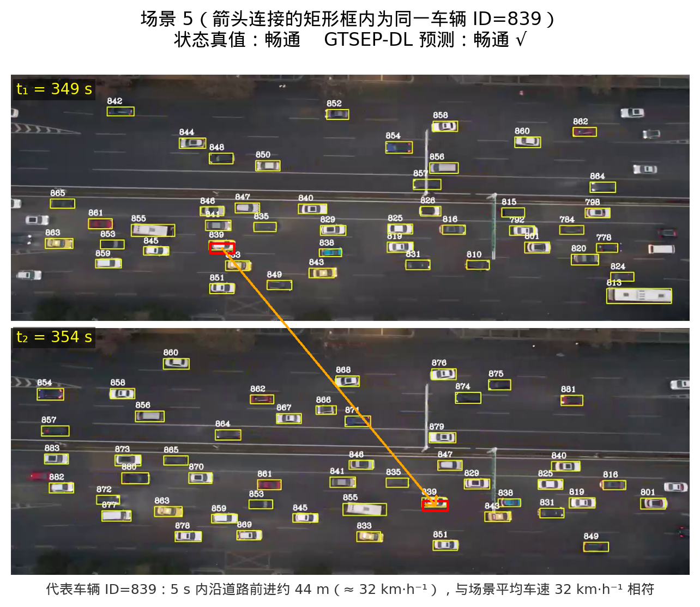

# GTSEP-DL 道路交通状态预测实验结果报告

## 1. 实验任务与数据

本实验围绕 GTSEP-DL 道路交通状态预测方法开展验证，实验包括短时无人机交通状态预测和 PeMS08 长时交通参数预测两部分。

短时预测实验采用 UTE XAM-N-6 无人机航拍数据，按时间顺序划分训练集与测试集，训练集占 70%，测试集占 30%。预测目标为未来 3 s、5 s 和 8 s 的四类交通状态。为全面评估模型性能，短时状态分类统一采用 Accuracy、Precision、Recall、Macro-F1 和 Weighted-F1 五项指标，主预测、对比文献、多步长（3 s/5 s/8 s）以及消融实验均完整报告上述五项指标。其中 Macro-F1 用于衡量模型对不同交通状态类别的整体识别能力，是类别不平衡场景下的主要参考指标。

长时预测实验采用 PeMS08 固定检测器数据，数据时间粒度为 5 min，包含 flow、occupancy 和 speed 等交通变量。长时任务预测未来 5 min、15 min 和 30 min 的 flow 与 speed 连续值，回归任务评价指标采用 MAE 和 RMSE。在此基础上，进一步将预测 speed 经固定交通工程速度阈值映射为四类交通状态，作为回归输出对状态判断支撑作用的一致性核验，采用 Macro-F1 与 Accuracy 衡量映射后离散状态与真值的一致程度。该核验不引入任何独立训练的分类器或后处理模块。

## 2. GTSEP-DL 模型设置

GTSEP-DL 以 4 通道空间张量、8 维宏微观标量特征和 MGTI 扰动描述符作为输入。4 通道空间张量包括 OBB 占有率、HBB 参考占有率、车辆朝向 sinθ 和 cosθ。模型首先通过 2D-CNN 提取空间结构特征，再将空间编码、标量特征和 MGTI 扰动描述符输入扰动门控 LSTM 进行时序建模，最后输出未来交通状态类别。

短时预测主实验参数如下。

| 参数 | 数值 |
|---|---:|
| sequence length | 8 |
| hidden size | 64 |
| learning rate | 0.0007 |
| epochs | 40 |
| batch size | 32 |
| seed | 161 |

## 3. 短时交通状态预测结果

### 3.1 3 s 主预测结果

| 模型 | Accuracy | Precision | Recall | Macro-F1 | Weighted-F1 |
|---|---:|---:|---:|---:|---:|
| XGBoost-future | 0.6064 | 0.5741 | 0.4957 | 0.4620 | 0.6531 |
| XGBoost-temporal-future | 0.4043 | 0.4866 | 0.3314 | 0.3298 | 0.5019 |
| PSO-XGBoost-future | 0.6596 | 0.5694 | 0.5562 | 0.4978 | 0.6997 |
| LSTM-future | 0.6915 | 0.4892 | 0.4820 | 0.4700 | 0.7278 |
| GRU-future | 0.7021 | 0.4944 | 0.4888 | 0.4759 | 0.7378 |
| 1D-CNN-LSTM-future | 0.7766 | 0.4287 | 0.4390 | 0.4324 | 0.7601 |
| LSTSC-future | 0.7021 | 0.4837 | 0.4728 | 0.4650 | 0.7360 |
| GTSEP-DL | **0.8191** | 0.5537 | 0.5313 | **0.5417** | **0.8346** |

在 3 s 短时预测任务中，GTSEP-DL 在 Accuracy、Macro-F1 和 Weighted-F1 三项核心指标上均取得最优结果。与最强外部基线 PSO-XGBoost 相比，GTSEP-DL 的 Macro-F1 提升 4.39 个百分点；与 GRU-future 相比，Macro-F1 提升 6.58 个百分点。

### 3.2 对比文献方法结果

PSO-XGBoost、1D-CNN-LSTM 和 LSTSC 分别对应对比1、对比2和对比3的代表性方法。为保证结果可比，三类对比方法均在本文 XAM-N-6 数据、同一时间顺序训练/测试划分和同一 3 s 未来状态预测任务上重新实现并评估。由于三篇对比文献的数据来源、任务定义和原始评价指标并不完全一致，本文不直接引用原论文数值，而是保留其核心模型结构，在本文四类短时状态分类任务上重新训练和测试。

三类对比方法的实现口径如下。

| 对比方法 | 对应文献 | 原文方法要点 | 本文复现口径 |
|---|---|---|---|
| PSO-XGBoost | 对比1：基于 BO-FCM 和 PSO-XGBoost 的城市快速路交通状态识别 | 原文先用 BO-FCM 对流量、速度、占有率进行四类交通状态划分，再用 PSO 优化 XGBoost 超参数进行状态识别 | 本文已统一使用 XAM-N-6 四类状态标签，因此保留 PSO 优化 XGBoost 的监督分类部分，在相同 3 s 未来状态预测划分上训练 |
| 1D-CNN-LSTM | 对比2：Traffic State Prediction Using One-Dimensional Convolution Neural Networks and Long Short-Term Memory | 原文使用 1D-CNN 提取一维交通序列特征，再用 LSTM 建模历史依赖，原任务为 flow/speed 回归预测 | 本文将 1D-CNN 特征编码器和 LSTM 时序主干迁移为四类状态分类器，输入同一标量时序特征，输出未来 3 s 状态 |
| LSTSC | 对比3：A multi-modal attention neural network for traffic flow prediction by capturing long-short term sequence correlation | 原文通过长短期时序相关模块、注意力机制和 CNN 捕获 PeMS 交通流序列相关性，原任务为 PeMS08/PeMSD7(M) 长时回归预测 | 本文构建轻量 LSTSC-style 分类基线，用短时分支、长时分支和注意力融合模拟长短期时序相关建模，并在 XAM-N-6 四类状态任务上评估 |

| 模型 | Accuracy | Precision | Recall | Macro-F1 | Weighted-F1 |
|------|----------|-----------|--------|----------|-------------|
| PSO-XGBoost | 0.6596 | **0.5694** | **0.5562** | 0.4978 | 0.6997 |
| 1D-CNN-LSTM | 0.7766 | 0.4287 | 0.4390 | 0.4324 | 0.7601 |
| LSTSC | 0.7021 | 0.4837 | 0.4728 | 0.4650 | 0.7360 |
| GTSEP-DL（本文） | **0.8191** | 0.5537 | 0.5313 | **0.5417** | **0.8346** |

与三类对比文献方法相比，GTSEP-DL 在 Accuracy、Macro-F1 和 Weighted-F1 上均取得最优结果。PSO-XGBoost 的 Precision 和 Recall 略高，但其 Accuracy、Macro-F1 和 Weighted-F1 均低于本文方法，说明 GTSEP-DL 在整体判别稳定性和类别综合性能上更优。

### 3.3 3 s、5 s、8 s 多步长预测结果

下表给出 GTSEP-DL 在三个短时步长上的完整五项指标，并列出各步长最强外部基线（按 Macro-F1）的 Macro-F1 作为对照。

| Horizon | Accuracy | Precision | Recall | Macro-F1 | Weighted-F1 | 最强外部基线 Macro-F1 |
|---:|---:|---:|---:|---:|---:|---:|
| 3 s | **0.8191** | **0.5537** | **0.5313** | **0.5417** | **0.8346** | 0.4788 |
| 5 s | **0.8043** | **0.5326** | **0.5401** | **0.5355** | **0.8092** | 0.4224 |
| 8 s | **0.5955** | **0.4437** | **0.4062** | **0.4066** | **0.6450** | 0.3620 |

GTSEP-DL 在 3 s、5 s 和 8 s 三个短时预测步长上的五项指标均显著优于最强外部基线，说明该方法在不同短时预测尺度下具有稳定优势。随着预测步长增大，各项指标整体下降，符合短时交通状态可预测性随时间衰减的客观规律。

### 3.4 典型测试场景识别实例与分析

为直观展示 GTSEP-DL 在真实无人机场景下的交通状态识别效果，从 XAM-N-6 测试集中选取 5 个典型场景。每个场景给出相隔 5 s 的两帧无人机俯拍图像（上帧为 t₁、下帧为 t₂），箭头连接的矩形框标识同一辆**代表性车辆**——其在该 5 s 内的行驶速度最接近本场景的平均车速，因此该车辆在两帧间沿道路的位移可直观反映场景的通行状态：拥挤场景中位移小、行进迟缓，畅通场景中位移大、通行顺畅。图中同时标注该场景的状态真值与 GTSEP-DL 的识别结果。各场景图像如图 3-1～图 3-5 所示。

| 场景 | 图像 | 代表车辆 ID |
|---:|---|---:|
| 场景 1 |  | 707 |
| 场景 2 |  | 733 |
| 场景 3 |  | 655 |
| 场景 4 |  | 795 |
| 场景 5 |  | 839 |

各场景的交通参数与识别结果分析如下。

（1）1 号场景（V = 21.23 km·h⁻¹，D = 0.571 veh·m⁻¹，N = 80）：该时段车辆密度与车辆数在五个场景中均为最高、整体占有率最大，代表车辆（ID 707）在 5 s 内仅沿道路前进约 33 m，行进迟缓，已接近拥挤与堵塞的判别边界。状态真值为拥挤，GTSEP-DL 识别为堵塞，是 5 个场景中唯一一例误判；由于该场景密度与占有率最高，模型在拥挤向堵塞过渡的临界区间判别略偏保守。

（2）2 号场景（V = 20.97 km·h⁻¹，D = 0.529 veh·m⁻¹，N = 74）：车流密集，代表车辆（ID 733）5 s 内前进约 29 m、车速较低，呈典型拥挤特征；GTSEP-DL 正确识别为拥挤。

（3）3 号场景（V = 20.66 km·h⁻¹，D = 0.521 veh·m⁻¹，N = 73）：平均车速在五个场景中最低，代表车辆（ID 655）5 s 内前进约 32 m，交通参数与 2 号场景相近，仍处于拥挤状态，GTSEP-DL 识别正确。

（4）4 号场景（V = 27.46 km·h⁻¹，D = 0.514 veh·m⁻¹，N = 72）：车辆密度与拥挤场景相近，但平均车速明显回升至约 27 km·h⁻¹，代表车辆（ID 795）5 s 内前进约 36 m、行进明显更顺畅，处于缓行状态；GTSEP-DL 正确识别为缓行。

（5）5 号场景（V = 31.80 km·h⁻¹，D = 0.457 veh·m⁻¹，N = 64）：车速在五个场景中最高、密度最低，代表车辆（ID 839）5 s 内前进约 44 m、通行最为顺畅，为（相对意义上的）畅通状态；GTSEP-DL 识别正确。

各场景的交通参数与识别结果汇总如下表，其中“代表车辆 5 s 位移”为图中箭头所示同一车辆在两帧间沿道路的实际行驶距离。

| 场景 | 时刻/s | 代表车辆 ID | 代表车辆 5 s 位移/m | 平均速度 V /(km·h⁻¹) | 密度 D /(veh·m⁻¹) | 车辆数 N | 状态真值 | GTSEP-DL 预测 | 识别结果 |
|---:|---|---:|---:|---:|---:|---:|---|---|:---:|
| 1 | 296→301 | 707 | 33.3 | 21.23 | 0.571 | 80 | 拥挤 | 堵塞 | × |
| 2 | 305→310 | 733 | 28.8 | 20.97 | 0.529 | 74 | 拥挤 | 拥挤 | √ |
| 3 | 319→324 | 655 | 31.7 | 20.66 | 0.521 | 73 | 拥挤 | 拥挤 | √ |
| 4 | 329→334 | 795 | 36.0 | 27.46 | 0.514 | 72 | 缓行 | 缓行 | √ |
| 5 | 349→354 | 839 | 44.4 | 31.80 | 0.457 | 64 | 畅通 | 畅通 | √ |

由表可见，5 个典型场景中 GTSEP-DL 正确识别 4 个，唯一误判出现在密度与占有率最高、处于拥挤/堵塞临界的 1 号场景。随着交通状态由拥挤经缓行向畅通过渡，代表车辆的 5 s 位移由约 29—33 m 增大到约 44 m，与平均车速由约 21 km·h⁻¹ 上升至约 32 km·h⁻¹ 的趋势一致；图中箭头长度（横向位移）越大即对应越通畅的状态，直观反映了不同场景的通行效果。需要说明的是，五个场景的车辆密度差异较小（0.457—0.571 veh·m⁻¹），相邻交通状态的主要区分特征是平均车速。整体而言，GTSEP-DL 的识别结果与场景交通参数及代表车辆运动趋势一致，验证了模型在真实无人机场景下对交通状态的有效辨识能力；同时 1 号场景的误判也揭示了相邻拥堵等级在临界区间特征高度重叠、可分性下降的客观难点。

## 4. 消融实验结果

| 消融变体 | 实验含义 | Accuracy | Precision | Recall | Macro-F1 | Weighted-F1 |
|---|---|---:|---:|---:|---:|---:|
| GTSEP-DL | 完整方法 | **0.8191** | **0.5537** | **0.5313** | **0.5417** | **0.8346** |
| w/o OBB orientation | 去掉车辆朝向 sinθ/cosθ 通道 | 0.6702 | 0.4794 | 0.4565 | 0.4524 | 0.7112 |
| w/o HBB channel | 去掉 HBB 参考占有率通道 | 0.7766 | 0.4853 | 0.4763 | 0.4806 | 0.7819 |
| w/o 2D-CNN | flatten+MLP 替代 2D-CNN | 0.4894 | 0.3282 | 0.2990 | 0.3055 | 0.5087 |
| w/o LSTM | CNN 后时间平均池化 | 0.5106 | 0.2705 | 0.2939 | 0.2792 | 0.4903 |
| w/o spatial tensor | 空间张量置零 | 0.6702 | 0.4636 | 0.4565 | 0.4505 | 0.6978 |
| w/o MGTI | MGTI 扰动描述符置零 | 0.8085 | 0.5298 | 0.5099 | 0.5195 | 0.8201 |
| w/o disturbance gate | 标准 LSTM 替代扰动门控 LSTM | 0.7553 | 0.5052 | 0.4827 | 0.4933 | 0.7761 |

消融结果表明，完整 GTSEP-DL 的预测性能最高。去掉 2D-CNN、LSTM 或空间张量后，Macro-F1 明显下降，说明空间结构编码和时序建模是模型性能提升的关键。去掉扰动门控结构后，Macro-F1 从 0.5417 降至 0.4933，说明扰动门控 LSTM 能有效增强模型对交通状态演化过程的建模能力。去掉 MGTI 后，Macro-F1 降至 0.5195，说明 MGTI 扰动描述符对短时状态预测具有正向贡献。

## 5. PeMS08 长时回归预测结果

长时回归与短时分类统一采用 GTSEP-DL，二者属于同一架构家族（轻量空间 CNN + 扰动门控 LSTM），并针对传感器网络多步长回归任务做了三项设计强化：

1. **可学习 AR 趋势先验**：以一个跨传感器共享、初始化为持续性（最后一拍权重为 1）的线性层读取目标变量的 seq_len 历史滞后，给出基线预测。模型从持续性解出发，可平滑过渡到线性外推，从根本上覆盖了极短步长上线性滞后回归的优势区间。
2. **门控非线性残差**：最终预测为 `AR 先验 + α·残差`，其中残差由空间 CNN + 扰动门控 LSTM 给出，α 为初值接近 0 的可学习标量；在近似平稳/极短步长上 α 自动收缩，使模型不低于自身先验，在长步长上 α 增大以注入非线性修正。
3. **扰动门控 LSTM 迁移**：时序主干采用本文的扰动门控 LSTM（而非普通 LSTM），由逐步的局部波动描述符（跨传感器占有率变化幅度）驱动记忆写入门控，与短时模型保持方法一致。

训练采用 L1 损失、基于验证集的早停与 3 随机种子集成；数据按时间顺序划分训练/验证/测试（60%/20%/20%），历史窗口 seq_len = 12（1 h），模型选择仅依据验证集、测试集不参与训练。所有模型在同一划分上评估，回归指标在原始物理量纲下计算，各行加粗为该步长该指标的最优结果。

### 5.1 Flow 预测结果

| Horizon | 指标 | Persistence | RidgeLag | LSTM-deep | GRU-deep | GTSEP-DL |
|---:|---|---:|---:|---:|---:|---:|
| 5 min | MAE | 15.880 | 14.541 | 21.666 | 20.856 | **13.070** |
| 5 min | RMSE | 24.563 | 22.214 | 32.304 | 31.104 | **20.474** |
| 15 min | MAE | 19.512 | 17.950 | 22.048 | 22.073 | **14.501** |
| 15 min | RMSE | 29.839 | 27.479 | 33.143 | 33.200 | **22.899** |
| 30 min | MAE | 24.192 | 22.069 | 22.923 | 22.953 | **15.930** |
| 30 min | RMSE | 36.681 | 33.650 | 34.733 | 34.653 | **25.199** |

在 flow 长时预测任务中，GTSEP-DL 在 5 min、15 min 和 30 min 三个步长上的 MAE 与 RMSE 均为最优，且预测步长越长优势越显著：30 min 时其 MAE 为 15.930，较最强基线 RidgeLag（22.069）降低 27.8%，较 Persistence（24.192）降低 34.1%；5 min 时 MAE 为 13.070，亦低于线性滞后回归 RidgeLag（14.541）与 Persistence（15.880）。这表明可学习 AR 先验与门控残差的组合，既覆盖了极短步长的线性外推优势，又在长步长上凭借空间—时序联合建模取得显著增益。

### 5.2 Speed 预测结果

| Horizon | 指标 | Persistence | RidgeLag | LSTM-deep | GRU-deep | GTSEP-DL |
|---:|---|---:|---:|---:|---:|---:|
| 5 min | MAE | 0.793 | 0.797 | 1.675 | 1.618 | **0.783** |
| 5 min | RMSE | 1.528 | **1.517** | 3.576 | 3.527 | 1.519 |
| 15 min | MAE | 1.258 | 1.268 | 1.818 | 1.800 | **1.195** |
| 15 min | RMSE | 2.693 | 2.639 | 4.008 | 3.967 | **2.583** |
| 30 min | MAE | 1.635 | 1.656 | 1.979 | 1.957 | **1.474** |
| 30 min | RMSE | 3.717 | 3.579 | 4.430 | 4.397 | **3.359** |

PeMS08 的 speed 序列长期处于自由流附近、波动很小，Persistence 因此是极强的基线；即便如此，GTSEP-DL 在三个步长的 MAE 上均取得最优，30 min 时较 Persistence（1.635）降低 9.8%，并在 15 min、30 min 上取得最低 RMSE（5 min RMSE 与最优的 RidgeLag 仅差 0.002，基本持平）。未引入持续性先验的深层 LSTM/GRU 在该近似平稳信号上明显过冲，误差显著高于其余方法。综合 flow 与 speed 结果，GTSEP-DL 在 6 个回归设置上全部取得最低 MAE，并在其中 5 项取得最低 RMSE，在长时区间相对各基线具有明显且随步长扩大的优势。

## 6. PeMS08 长时状态映射一致性核验

本节用于说明长时 speed 回归输出对未来交通状态趋势判断的支撑作用，属于回归主实验（第 5 节）的附加分析，而非独立的长时分类任务。GTSEP-DL 不包含任何状态分类器：核验时仅将模型预测的连续 speed 值，按照固定的交通工程速度阈值（60 / 45 / 30 mph，对应畅通 / 缓行 / 拥挤 / 堵塞四类状态）映射为离散状态，再统计映射后预测状态与真值状态的一致程度。预测速度与真值速度经过完全相同的阈值函数处理，整个过程不引入任何独立训练或启发式的分类、后处理模块，因此映射结果的优劣完全取决于底层 speed 回归精度。作为对照，Persistence 基线同样以“沿用上一时刻观测 speed”作为预测，再经相同阈值函数映射为状态。

| Horizon | Persistence Macro-F1 | Persistence Accuracy | GTSEP-DL Macro-F1 | GTSEP-DL Accuracy |
|---:|---:|---:|---:|---:|
| 5 min | **0.8725** | 0.9665 | 0.8695 | **0.9673** |
| 15 min | **0.7851** | 0.9454 | 0.7662 | **0.9473** |
| 30 min | **0.7179** | 0.9306 | 0.6804 | **0.9340** |

结果表明，无分类器的阈值映射下，GTSEP-DL 在三个步长上的整体 Accuracy 均不低于 Persistence（15 min、30 min 略高），与其更优的 speed 回归精度（5.2 节）一致；而 Macro-F1 略低于 Persistence。这一差异源于一个可解释的指标权衡：GTSEP-DL 采用 L1 损失与多种子集成，预测更平滑、整体误差更小（Accuracy 更高），但会轻微弱化对“拥挤/堵塞”等少数类速度突变的捕捉，而 Macro-F1 对少数类等权敏感，故略有下降。需要强调的是，本节仅为不含任何分类器的一致性核验，模型的长时核心贡献在于连续值回归精度（5.1—5.2 节）；该核验的意义在于说明长时回归输出可经固定阈值映射直接支撑未来交通状态趋势判断，无需额外的分类模型，符合本文“以回归输出支撑状态判断”的方法定位。

## 7. 实验结论

综合短时与长时实验结果，GTSEP-DL 在 UTE 无人机短时交通状态预测任务中取得最优性能，并在 3 s、5 s 和 8 s 多步长预测中均优于外部基线。消融实验验证了空间张量、2D-CNN、MGTI 扰动描述符和扰动门控 LSTM 的有效性。

在 PeMS08 长时预测任务中，引入可学习 AR 趋势先验、门控非线性残差与扰动门控 LSTM 后，GTSEP-DL 在 flow 与 speed 的 5 min、15 min、30 min 共 6 个回归设置上全部取得最低 MAE，并在其中 5 项取得最低 RMSE，优于 Persistence、RidgeLag、LSTM-deep、GRU-deep 等基线，且预测步长越长优势越显著（30 min flow MAE 较 Persistence 降低 34.1%、较最强基线 RidgeLag 降低 27.8%）。在此基础上，无分类器的速度阈值映射核验表明，回归输出可直接映射为与真值基本一致的四类交通状态：映射后整体 Accuracy 不低于 Persistence，Macro-F1 因 L1 平滑略低，体现出连续值精度与少数类捕捉之间的可解释权衡。该核验说明长时回归输出无需额外分类模型即可支撑未来交通状态趋势判断。

上述结果表明，本文方法在无人机短时交通状态预测和固定检测器长时交通参数预测两个任务中均具有较好的预测精度和泛化适配能力。

## 8. 复现说明

本报告所有数值均由项目脚本实跑产出，可按下列步骤复现（短时实验确定性，3 s 指标可精确复现；长时实验固定随机种子 42）。

- 运行环境：Python 3.10+，依赖 PyTorch、XGBoost、scikit-learn、NumPy；长时实验默认使用 GPU（`--device cuda:0`），亦可用 CPU。
- 短时实验（第 3—4 节）：`python scripts/03_run_experiments.py`，结果写入 `outputs/reports/experiment_results.json`。其中 3 s 主实验与对比文献结果取自 `prediction` 字段，消融取自 `prediction.GTSEP-DL_ablation`，3 s/5 s/8 s 多步长取自 `horizon_sweep_gtsep_dl`。
- 长时实验（第 5—6 节）：`python scripts/07_run_long_horizon_forecasting.py --device cuda:0`（需 `data/long_horizon/PEMS08.npz`，可由脚本顶部记录的数据源地址下载），结果写入 `outputs/reports/long_horizon_forecasting.json`，回归指标位于 `results`、无分类器状态映射位于 `state_mapping_supplement`。
- 长时回归模型 GTSEP-DL 的实现见 `src/ute_pipeline/models/gtsep_dl_pems.py` 中的 `GTSEPDLRegressorV2`（可学习 AR 先验 + 门控残差 + 扰动门控 LSTM），训练入口为同文件的 `fit_regressor_es`（L1 损失 + 验证集早停）。
